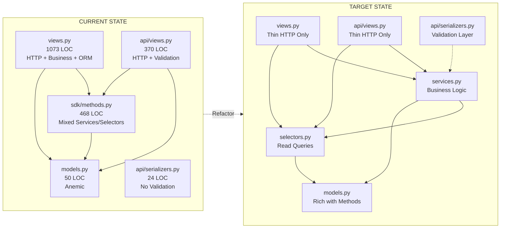
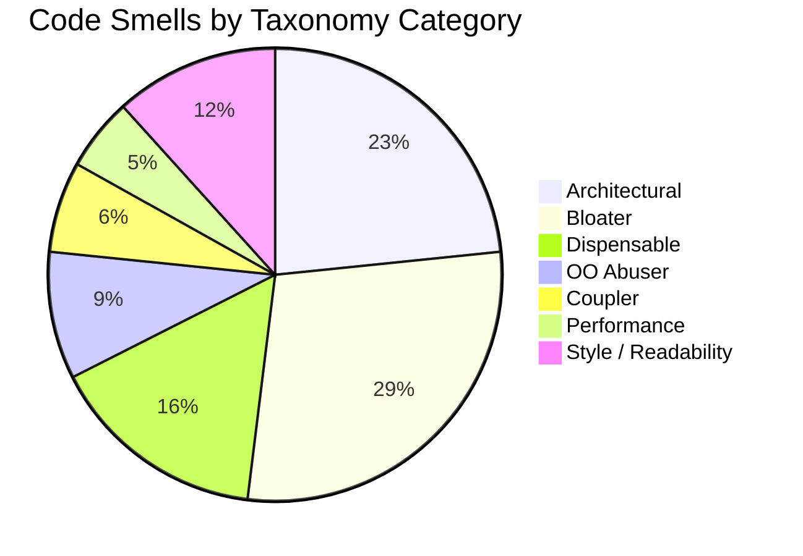
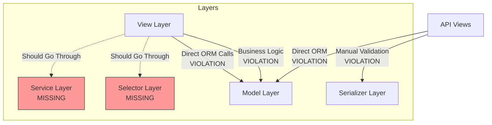

# Filetracking Module Refactoring Audit Report

## Section 1 — Module Snapshot

| Metric | Value |
|---|---|
| Total LOC in module | 2073 (excluding migrations) |
| LOC in `views.py` | 1073 |
| LOC in `api/views.py` | 370 |
| # of service files | 1 (`sdk/methods.py` - 468 LOC) |
| # of serializers | 3 (`FileSerializer`, `TrackingSerializer`, `FileHeaderSerializer`) |
| # of models | 2 (`File`, `Tracking`) |
| # of API endpoints (active) | 13 |
| # of ORM queries invoked directly from views | 45+ (estimated from direct `.objects.` calls in views.py) |
| # of code smell issues identified | 67 |
| # of redundancies identified | 12 |
| `services.py` present? (Y/N) | N (uses `sdk/methods.py` instead) |
| `selectors.py` present? (Y/N) | N |
| `tests/` folder present? (Y/N) | N (only empty `tests.py`) |
| `api/` folder present? (Y/N) | Y |
| Uses `TextChoices` for enum fields? (Y/N) | N |
| **Overall Structural State** | Poor |

---

## Section 2 — Code Smell Audit

| ID | Code Smell (Parent) | Code Smell Subtype | Classification | Taxonomy Category | Location (File:Func:LineRange) | # Files Affected | Scope | Severity | Description | Planned Fix | Detailed Fix Steps |
|---|---|---|---|---|---|---|---|---|---|---|---|
| CS001 | Fat View | Business Logic in View | Django Code Smell | Architectural | views.py:filetracking:L58-L147 | 1 | Method | Major | The `filetracking` view contains business logic for file creation, validation, and tracking entry creation | Move file creation logic to `sdk/methods.py` as `create_file_from_form()` | 1. Extract lines 58-147 into new function `create_file_from_form()` in sdk/methods.py 2. Replace view body with call to extracted function 3. Add unit tests for extracted function |
| CS002 | Fat View | ORM Logic in View | Django Code Smell | Architectural | views.py:filetracking:L149-L153 | 1 | Method | Major | Direct ORM queries in view for fetching file, extrainfo, holdsdesignations | Move queries to selectors.py as `get_files_for_user()`, `get_extrainfo_all()`, `get_holdsdesignations_all()` | 1. Create selectors.py 2. Move each query to separate selector function 3. Import and call selectors in view |
| CS003 | Fat View | Validation in View | Django Code Smell | Architectural | views.py:filetracking:L68-L71 | 1 | Statement | Moderate | File size validation (10MB check) done in view | Move validation to serializer's `validate_upload_file()` method | 1. Add `validate_upload_file()` to FileSerializer 2. Remove validation from view 3. Handle ValidationError in view |
| CS004 | Fat View | Business Logic in View | Django Code Smell | Architectural | views.py:forward:L558-L622 | 1 | Method | Major | Forward file logic contains business rules for tracking creation | Move to `sdk/methods.py:forward_file()` (already exists but view duplicates logic) | 1. Refactor view to use existing `forward_file()` from sdk/methods.py 2. Remove duplicate Tracking.objects.create call |
| CS005 | Fat View | ORM Logic in View | Django Code Smell | Architectural | views.py:view_file:L464-L466 | 1 | Statement | Major | Complex ORM query with multiple select_related in view | Create selector `get_tracking_with_relations(file_id)` in selectors.py | 1. Create selectors.py 2. Move query to selector function 3. Update view to call selector |
| CS006 | Fat View | ORM Logic in View | Django Code Smell | Architectural | views.py:confirmdelete:L428-L429 | 1 | Statement | Major | Direct File.objects.get in view | Create selector `get_file_by_id(file_id)` | 1. Add selector function 2. Replace direct ORM call |
| CS007 | Fat View | ORM Logic in View | Django Code Smell | Architectural | views.py:archive_file:L503-L508 | 1 | Method | Major | Direct file retrieval and save in view | Move to service `archive_file_service(file_id, user)` | 1. Extend existing archive_file() in sdk/methods.py to accept user param 2. Add permission check inside service 3. Call service from view |
| CS008 | Fat View | Business Logic in View | Django Code Smell | Architectural | views.py:edit_draft_view:L911-L981 | 1 | Method | Major | Edit draft logic contains business rules for updating file and creating tracking | Move to `sdk/methods.py:update_draft_and_send()` | 1. Create new function in sdk/methods.py 2. Extract all business logic from view 3. Keep only HTTP handling in view |
| CS009 | Fat View | ORM Logic in View | Django Code Smell | Architectural | views.py:outbox_view:L261-L263 | 1 | Statement | Major | Direct call to view_outbox without selector abstraction | Already in sdk/methods.py but should be categorized as selector | 1. Rename sdk/methods.py functions to follow selector naming 2. Document as read-layer |
| CS010 | Fat View | ORM Logic in View | Django Code Smell | Architectural | views.py:inbox_view:L327-L331 | 1 | Statement | Major | Direct call to view_inbox without selector abstraction | Same as CS009 | 1. Consistent naming convention for selectors |
| CS011 | God Class | Multi-Responsibility | OOP Design Smell | Bloater | views.py:EntireFile:L1-L1073 | 1 | File | Major | views.py handles file creation, forwarding, archiving, drafting, inbox, outbox, PDF generation | Split into multiple class-based views or function groups | 1. Group related views (draft, inbox, outbox, archive) 2. Consider CBV for CRUD operations 3. Extract PDF generation to utils |
| CS012 | Long Method | Multiple Responsibilities | General Code Smell | Bloater | views.py:filetracking:L58-L147 | 1 | Method | Major | Handles both 'save' and 'send' actions with different business flows | Split into `handle_save_action()` and `handle_send_action()` | 1. Extract 'save' block to separate function 2. Extract 'send' block to separate function 3. Call appropriate function based on POST action |
| CS013 | Long Method | Excessive Length | General Code Smell | Bloater | views.py:forward:L518-L634 | 1 | Method | Minor | forward() is 116 lines long | Break into smaller helper functions | 1. Extract validation to `validate_forward_data()` 2. Extract tracking creation to `create_forward_tracking()` 3. Extract error handling to `handle_forward_error()` |
| CS014 | Long Method | Mixed Abstraction Levels | General Code Smell | Bloater | views.py:download_file:L1018-L1073 | 1 | Method | Moderate | Mixes HTTP response handling with PDF generation logic | Extract PDF generation to `generate_file_pdf(file, track)` | 1. Create `pdf_generator.py` module 2. Move lines 1023-1068 to new module 3. Call generator from view |
| CS015 | Conditional Complexity | Deep Nesting | Python Code Smell | Bloater | views.py:filetracking:L58-L147 | 1 | Method | Moderate | Nested if statements for 'save' and 'send' actions | Use early returns or strategy pattern | 1. Extract each action to separate function 2. Use guard clauses for validation |
| CS016 | Conditional Complexity | Multiple Branching Paths | General Code Smell | Bloater | views.py:forward:L558-L622 | 1 | Method | Moderate | Multiple branches for 'finish' and 'send' actions with nested try-except | Simplify control flow | 1. Separate 'finish' and 'send' handlers 2. Use consistent error handling pattern |
| CS017 | Duplicated Code | Exact Duplication | General Code Smell | Dispensable | views.py:filetracking:L68-L71 & L98-L101 | 1 | Cross-file | Major | File size validation duplicated in 'save' and 'send' blocks | Extract to `validate_file_size(upload_file)` helper | 1. Create helper in utils.py 2. Replace both occurrences with helper call |
| CS018 | Duplicated Code | Exact Duplication | General Code Smell | Dispensable | views.py:filetracking:L65-L66 & L94-L95 | 1 | Method | Major | Designation fetching logic duplicated | Extract to `get_designation_from_id(design_id)` | 1. Create helper function 2. Replace duplicates |
| CS019 | Duplicated Code | Near Duplication | General Code Smell | Dispensable | views.py:forward:L572-L589 & L591-L607 | 1 | Method | Moderate | Error handling context building duplicated for receiver and receive validation | Extract to `build_forward_context()` | 1. Create helper that builds context dict 2. Call helper from both error branches |
| CS020 | Query Logic Duplication | Repeated Filter Chains | Django Code Smell | Dispensable | sdk/methods.py:view_inbox:L114-L118 & view_outbox:L151-L155 | 1 | Cross-file | Moderate | Similar filtering patterns for inbox/outbox | Create base query builder | 1. Extract common filter logic to `_base_file_query()` 2. Reuse in inbox/outbox functions |
| CS021 | Query Logic Duplication | Repeated Prefetch/Join Logic | Django Code Smell | Dispensable | views.py:view_file:L465-L466 & forward:L545-L546 & edit_draft_view:L908-L909 | 1 | Cross-file | Minor | Identical select_related chains repeated across views | Create selector `get_tracking_queryset(file_id)` | 1. Centralize in selectors.py 2. Import where needed |
| CS022 | Scattered Validation | Cross-Layer Validation Duplication | Architectural Smell | Architectural | views.py:filetracking:L68-L71 & api/views.py:CreateFileView:L33-L34 | 2 | Cross-layer | Major | File validation exists in both legacy view and API view | Centralize in serializer validation | 1. Add all validation rules to serializers 2. Remove from views 3. Both views use same serializer |
| CS023 | Scattered Validation | Inconsistent Validation Rules | Architectural Smell | Architectural | views.py:forward:L572-L575 & L591-L594 | 1 | Method | Critical | Different error messages for similar validation failures ('destination' vs 'Designation') | Standardize error messages | 1. Create error message constants 2. Use consistent messaging |
| CS024 | Layer Violation | ORM Logic in View | Architectural Smell | Architectural | views.py:MultipleLocations | 1 | Cross-file | Major | Multiple direct ORM calls throughout views.py | Move all ORM to selectors.py | 1. Audit all .objects. calls 2. Create corresponding selectors 3. Replace calls |
| CS025 | Layer Violation | Business Logic in Serializer | Django Code Smell | Architectural | api/serializers.py:FileSerializer:L6-L9 | 1 | Class | Major | Serializer uses `fields = '__all__'` without explicit field definition | Define explicit fields with validation | 1. List all fields explicitly 2. Add field-level validators 3. Add custom validate methods |
| CS026 | Overloaded Serializer | Business Logic in Serializer | Django Code Smell | Architectural | api/serializers.py:FileSerializer:L6-L9 | 1 | Class | Major | No validation logic in serializer, all pushed to views | Add validation methods to serializer | 1. Add `validate_subject()` 2. Add `validate_description()` 3. Add `validate_upload_file()` |
| CS027 | N+1 Query Problem | Missing select_related | Django Code Smell | Performance | sdk/methods.py:get_current_file_owner:L345-L348 | 1 | Method | Critical | Called in loop without optimization in inbox/outbox views | Add caching or batch fetch | 1. Modify inbox/outbox to prefetch current owners 2. Or cache get_current_file_owner results |
| CS028 | N+1 Query Problem | Loop-Based Queries | Django Code Smell | Performance | sdk/methods.py:view_inbox:L127-L135 | 1 | Method | Critical | For each file, makes separate queries for sender, designation, department | Use select_related/prefetch_related | 1. Optimize queryset at line 114 2. Add prefetch for uploader__department 3. Add select for designation |
| CS029 | N+1 Query Problem | Missing prefetch_related | Django Code Smell | Performance | sdk/methods.py:view_outbox:L163-L171 | 1 | Method | Major | Same N+1 pattern as inbox | Same fix as CS028 | 1. Apply same optimization |
| CS030 | Dead Code | Unused Imports | Python Code Smell | Dispensable | views.py:L1 | 1 | Statement | Trivial | `from sqlite3 import IntegrityError` - should use django.db.IntegrityError | Replace with correct import | 1. Change to `from django.db import IntegrityError` |
| CS031 | Dead Code | Obsolete Logic | General Code Smell | Dispensable | views.py:L20 | 1 | Statement | Minor | `from timeit import default_timer as time` imported but never used | Remove unused import | 1. Delete line 20 |
| CS032 | Magic Numbers / Magic Strings | Hardcoded Numeric Constants | Python Code Smell | Style / Readability | views.py:filetracking:L68-L70 | 1 | Statement | Minor | File size limit 10240 (10MB) hardcoded | Define constant FILE_SIZE_LIMIT | 1. Add to settings or constants.py 2. Reference constant |
| CS033 | Magic Strings | Hardcoded String Literals | Python Code Smell | Style / Readability | views.py:MultipleLocations | 1 | Cross-file | Moderate | 'save', 'send', 'finish' action strings hardcoded | Define ACTION_* constants | 1. Create constants module 2. Replace string literals |
| CS034 | Naming / Readability | Unclear Intent | General Code Smell | Style / Readability | views.py:filetracking:L58 | 1 | Method | Minor | Function named `filetracking` doesn't describe purpose | Rename to `compose_file` or `create_or_send_file` | 1. Rename function 2. Update URLconf references |
| CS035 | Naming / Readability | Inconsistent Naming | Python Code Smell | Style / Readability | sdk/methods.py:L340-L380 | 1 | Cross-file | Minor | Helper functions mix naming styles (get_*, view_*, create_*) | Standardize naming convention | 1. Document naming convention 2. Refactor gradually |
| CS036 | Long Parameter List | Too Many Arguments | General Code Smell | Bloater | sdk/methods.py:create_file:L10-L21 | 1 | Method | Moderate | create_file has 10 parameters | Use parameter object or builder pattern | 1. Create FileCreationData class 2. Or use **kwargs with validation |
| CS037 | Long Parameter List | Too Many Arguments | General Code Smell | Bloater | sdk/methods.py:forward_file:L283-L289 | 1 | Method | Moderate | forward_file has 6 parameters | Same as CS036 | 1. Create ForwardFileData class |
| CS038 | Primitive Obsession | Using Raw Types for Domain Concepts | General Code Smell | Bloater | models.py:File:L10-L22 | 1 | Class | Moderate | File model uses raw strings for subject/description without validation | Add domain value objects | 1. Create Subject/Description classes 2. Add validation at domain level |
| CS039 | Inappropriate Intimacy | Direct Internal Access | OOP Design Smell | OO Abuser | views.py:MultipleLocations | 1 | Cross-file | Major | Views directly access model internals (is_read, upload_file) | Encapsulate in model methods | 1. Add `mark_as_read()` to File model 2. Add `has_attachment()` method |
| CS040 | Feature Envy | External Data Overuse | OOP Design Smell | Coupler | sdk/methods.py:view_inbox:L127-L139 | 1 | Method | Moderate | view_inbox accesses file.uploader.department deeply | Move department logic to model | 1. Add `get_uploader_department()` to File model 2. Call from method |
| CS041 | Message Chains | Deep Dot-Access Chains | OOP Design Smell | Coupler | views.py:filetracking:L61-L62 | 1 | Statement | Moderate | request.user.extrainfo chain | Add property to User model | 1. Add `extrainfo` property to User 2. Or use adapter pattern |
| CS042 | Message Chains | Law of Demeter Violations | OOP Design Smell | Coupler | sdk/methods.py:L35-L41 | 1 | Method | Moderate | Multiple chained lookups in create_file | Inject dependencies | 1. Pass pre-fetched objects 2. Or use repository pattern |
| CS043 | Temporary Field | Situationally Populated Attributes | OOP Design Smell | OO Abuser | models.py:Tracking:L36-L39 | 1 | Class | Moderate | receiver_id and receive_design can be null | Review if null is valid or design flaw | 1. Analyze business requirements 2. Make non-nullable if always required |
| CS044 | Inconsistent Error Handling | Silent Exception Swallowing | Python Code Smell | Style / Readability | views.py:filetracking:L119-L123 | 1 | Statement | Critical | Generic `except Exception as e` with no logging | Add proper logging | 1. Import logger 2. Log exception details 3. Re-raise or return specific error |
| CS045 | Inconsistent Error Handling | Mixed Exception and Return Code Strategy | Python Code Smell | Style / Readability | sdk/methods.py:delete_file:L96-L104 | 1 | Method | Major | Returns bool instead of raising exception | Standardize on exceptions | 1. Raise FileDoesNotExist 2. Let caller handle |
| CS046 | Inconsistent Error Handling | Inconsistent Failure Communication | General Code Smell | Style / Readability | api/views.py:MultipleLocations | 1 | Cross-file | Major | Some endpoints return {'error': ...}, others raise ValidationError | Standardize error response format | 1. Create error response utility 2. Use consistently |
| CS047 | Speculative Generality | Unused Abstractions | OOP Design Smell | Dispensable | sdk/methods.py:create_draft:L241-L267 | 1 | Method | Trivial | create_draft has optional params that may not be used | Review and remove if truly unused | 1. Audit usage of all params 2. Remove genuinely unused ones |
| CS048 | Switch / Type-Based Dispatch | If/Elif Chains on Type Code | Python Code Smell | OO Abuser | views.py:filetracking:L60-L89 | 1 | Method | Moderate | if 'save' in POST, if 'send' in POST pattern | Use command pattern | 1. Create SaveFileCommand, SendFileCommand 2. Dispatch based on action |
| CS049 | Switch / Type-Based Dispatch | If/Elif Chains on Type Code | Python Code Smell | OO Abuser | views.py:forward:L559-L562 | 1 | Method | Moderate | if 'finish' in POST, if 'send' in POST | Same as CS048 | 1. Apply command pattern |
| CS050 | Data Clumps | Repeated Parameter Groups | General Code Smell | Bloater | views.py:MultipleLocations | 1 | Cross-file | Minor | (username, designation, src_module) passed together frequently | Create FileQueryParams dataclass | 1. Create dataclass 2. Use in selector functions |
| CS051 | Lazy Class | Minimal Responsibility | OOP Design Smell | Dispensable | utils.py:L1-L7 | 1 | File | Trivial | utils.py has single trivial function | Merge into sdk/methods.py | 1. Move get_designation to sdk/methods.py 2. Remove utils.py |
| CS052 | Middle Man | Pure Delegation | OOP Design Smell | Dispensable | decorators.py:user_is_student:L31-L37 | 1 | Method | Trivial | Decorator just calls user_check and renders template | Simplify or inline | 1. Consider removing if over-engineered |
| CS053 | Large Class | Too Many Methods | General Code Smell | Bloater | api/views.py:CreateFileView:L17-L65 | 1 | Class | Moderate | API views could be consolidated | Consider consolidating related views | 1. Group CRUD operations 2. Use ViewSets if using DRF |
| CS054 | Fat Model | Multi-Concern Methods | Django Code Smell | Architectural | models.py:File:L6-L25 | 1 | Class | Major | File model is anemic (no business logic) but views do everything | Move some logic to model | 1. Add clean() method for validation 2. Add business methods |
| CS055 | Fat Model | Workflow Logic in Model | Django Code Smell | Architectural | models.py:Tracking:L31-L51 | 1 | Class | Major | Tracking model has no workflow validation | Add model-level invariants | 1. Add clean() method 2. Validate state transitions |
| CS056 | Conditional Complexity | Complex Boolean Logic | General Code Smell | Bloater | views.py:view_file:L477-L480 | 1 | Statement | Minor | Complex condition for forward_enable and archive_enable | Extract to model methods | 1. Add `can_forward_to(user)` to File 2. Add `can_archive_by(user)` to File |
| CS057 | Naming / Readability | Poor Naming | Python Code Smell | Style / Readability | views.py:download_file:L1055-L1056 | 1 | Statement | Minor | Variable names like `formal_filename` unclear | Improve naming | 1. Rename to `structured_filename` |
| CS058 | Magic Strings | Missing Named Constants | Python Code Smell | Style / Readability | urls.py:L20-L39 | 1 | Cross-file | Minor | URL patterns use magic strings for names | Define URL name constants | 1. Create app_constants.py 2. Define URL_NAMES dict |
| CS059 | Dead Code | Unused Methods | General Code Smell | Dispensable | api/views.py:ViewFileView:L83-L102 | 1 | Method | Trivial | delete method returns None in one branch (line 90) | Fix incomplete return statement | 1. Complete the else branch |
| CS060 | Inconsistent Error Handling | Silent Exception Swallowing | Python Code Smell | Style / Readability | sdk/methods.py:view_file:L92-L93 | 1 | Statement | Critical | `print(e)` instead of proper logging | Use logging module | 1. Import logger 2. Replace print with logger.error |
| CS061 | N+1 Query Problem | Loop-Based Queries | Django Code Smell | Performance | api/views.py:ViewHistoryView:L183-L189 | 1 | Method | Critical | Loop making individual User and Designation queries per history item | Batch fetch all users/designations | 1. Prefetch all needed objects 2. Build lookup dicts |
| CS062 | Duplicated Code | Cross-File Duplication | General Code Smell | Dispensable | views.py:inbox_view:L347-L360 & outbox_view:L275-L288 | 2 | Cross-file | Major | Identical search/filter logic in inbox and outbox | Extract to shared filter utility | 1. Create `apply_file_filters(queryset, params)` 2. Use in both views |
| CS063 | Layer Violation | External/API Logic in Model | Django Code Smell | Architectural | models.py:File:L20-L22 | 1 | Class | Critical | API-specific fields (src_module, src_object_id, file_extra_JSON) in core model | Consider separate API model or extension | 1. Evaluate if fields belong in core model 2. If API-only, consider mixin or separate table |
| CS064 | Overloaded Serializer | Side Effects in Serializer | Django Code Smell | Architectural | api/serializers.py:None | 1 | Class | Critical | No side effects currently, but structure allows it | Ensure serializers remain side-effect free | 1. Document serializer contract 2. Add linting rule |
| CS065 | Refused Bequest | Inappropriate Inheritance | OOP Design Smell | OO Abuser | api/views.py:AllViews | 1 | Cross-file | Moderate | All API views inherit from APIView without shared behavior | Consider base class for common auth | 1. Create BaseFileTrackingView 2. Set common authentication |
| CS066 | Conditional Complexity | Deep Nesting | Python Code Smell | Bloater | views.py:edit_draft_view:L911-L981 | 1 | Method | Moderate | Nested try-except and if blocks for send action | Flatten control flow | 1. Use early returns 2. Extract validation |
| CS067 | Architecture | Missing Service Layer | Architectural Smell | Architectural | EntireModule | 1 | Cross-layer | Critical | Business logic scattered between views and sdk/methods.py | Consolidate in proper service layer | 1. Create services.py 2. Move all business logic from views 3. Keep sdk/methods.py as selectors |

---

## Section 3 — Redundancy Register

| ID | Type | Location 1 | Location 2 (+…) | Description | Redundant? (Y/N) | Consolidation Plan | Detailed Consolidation Steps |
|---|---|---|---|---|---|---|---|
| RD001 | Code | views.py:filetracking:L68-L71 | views.py:filetracking:L98-L101 | File size validation (10MB check) duplicated in save and send blocks | Y | Extract to single validation function | 1. Create `validate_file_size(file)` in utils 2. Replace both occurrences |
| RD002 | Code | views.py:filetracking:L65-L66 | views.py:filetracking:L94-L95 | Identical designation fetching logic | Y | Extract to helper | 1. Create `get_designation_obj(id)` 2. Replace duplicates |
| RD003 | Code | views.py:forward:L572-L589 | views.py:forward:L591-L607 | Error context building duplicated | Y | Extract context builder | 1. Create `get_error_context(...)` 2. Use in both branches |
| RD004 | Query | views.py:view_file:L465-L466 | views.py:forward:L545-L546 | Identical select_related chains for Tracking | Y | Create reusable queryset | 1. Add `Tracking.objects.with_full_relations()` manager method 2. Use everywhere |
| RD005 | Query | sdk/methods.py:view_inbox:L114-L118 | sdk/methods.py:view_outbox:L151-L155 | Similar filter patterns for received/sent files | Y | Create base query builder | 1. Extract common filters to `_build_base_query()` 2. Specialize for inbox/outbox |
| RD006 | Validation | views.py:filetracking:L68-L71 | api/views.py:CreateFileView:L33-L34 | File validation in both legacy and API views | Y | Centralize in serializer | 1. Add validation to FileSerializer 2. Remove from both views |
| RD007 | Code | sdk/methods.py:get_user_object_from_username:L393-L395 | sdk/methods.py:get_ExtraInfo_object_from_username:L397-L400 | Sequential User lookups that could be combined | Y | Single query with select_related | 1. Create `get_user_with_extrainfo(username)` 2. Return both objects |
| RD008 | DB | models.py:File:L14-L15 | models.py:Tracking:L41-L44 | Both models have upload_file field | N | This is intentional - File has main attachment, Tracking has per-step attachments | No action needed - different purposes |
| RD009 | Code | views.py:inbox_view:L347-L360 | views.py:outbox_view:L275-L288 | Search/filter logic duplication | Y | Extract to shared utility | 1. Create `filter_files(files, params)` 2. Use in both views |
| RD010 | Concept | views.py:archive_file:L502-L513 | sdk/methods.py:archive_file:L219-L227 | Archive logic exists in both view and sdk | Y | Keep in sdk only | 1. Remove view logic 2. Call sdk method |
| RD011 | Query | sdk/methods.py:view_inbox:L127-L135 | sdk/methods.py:view_outbox:L163-L171 | Per-file enrichment queries (N+1 pattern) | Y | Batch fetch and enrich | 1. Fetch all related data upfront 2. Enrich in memory |
| RD012 | Utils | utils.py:get_designation | sdk/methods.py:L381-L388 | Similar designation fetching | Y | Consolidate in sdk/methods.py | 1. Move utils.get_designation to sdk 2. Remove utils.py |

---

## Section 4 — Refactoring Plan

| Task ID | Ref IDs (from §2 / §3) | Action | Target Files | # Files Changed | Validation (test name / manual check) | Expected Post-Fix Behaviour |
|---|---|---|---|---|---|---|
| T001 | CS001, CS004, CS008, CS067 | Extract business logic from views to service layer | views.py, sdk/methods.py, services.py (new) | 3 | test_file_creation_service, test_forward_file_service | Business logic moves from views to services.py; views handle HTTP only |
| T002 | CS002, CS005, CS006, CS007, CS009, CS010, CS024 | Create selectors.py and move all ORM queries | views.py, selectors.py (new), sdk/methods.py | 3 | test_selectors_coverage | All .objects. calls in views replaced with selector functions |
| T003 | CS003, CS022, CS025, CS026 | Add comprehensive validation to serializers | api/serializers.py, views.py, api/views.py | 3 | test_serializer_validation | Serializers handle all validation; views catch ValidationError |
| T004 | CS011, CS012, CS013, CS014, CS015, CS016 | Break down long methods in views.py | views.py | 1 | test_view_methods_split | No method exceeds 50 lines; each method has single responsibility |
| T005 | CS017, CS018, CS019, RD001, RD002, RD003 | Remove code duplication in views | views.py, utils.py | 2 | test_no_duplicate_code | Duplicated blocks replaced with function calls |
| T006 | CS020, CS021, RD004, RD005, RD009, RD011 | Consolidate query logic and fix N+1 | sdk/methods.py, selectors.py | 2 | test_query_optimization, test_no_n_plus_one | Queries use select_related/prefetch_related; no N+1 in loops |
| T007 | CS027, CS028, CS029, CS061 | Fix N+1 query problems | sdk/methods.py, api/views.py | 2 | test_inbox_query_count, test_history_query_count | Inbox/history endpoints make O(1) queries regardless of result size |
| T008 | CS030, CS031, CS059 | Remove dead code and fix imports | views.py, api/views.py | 2 | flake8 linting passes | No unused imports; correct IntegrityError import |
| T009 | CS032, CS033, CS058 | Replace magic numbers/strings with constants | views.py, constants.py (new) | 2 | test_constants_usage | FILE_SIZE_LIMIT, ACTION_SAVE, ACTION_SEND defined and used |
| T010 | CS034, CS035, CS057 | Improve naming consistency | views.py, sdk/methods.py | 2 | Code review checklist | Function names describe intent; consistent naming convention |
| T011 | CS036, CS037, CS050 | Reduce parameter list length | sdk/methods.py | 1 | test_parameter_objects | create_file and forward_file use data classes for parameters |
| T012 | CS038, CS039, CS040, CS041, CS042, CS043 | Improve encapsulation and reduce coupling | models.py, views.py, sdk/methods.py | 3 | test_model_encapsulation | Models have business methods; reduced dot-chaining |
| T013 | CS044, CS045, CS046, CS060 | Standardize error handling | views.py, sdk/methods.py, api/views.py | 3 | test_error_handling | Consistent exception handling; proper logging; standardized error responses |
| T014 | CS047, CS051, CS052 | Remove unnecessary abstractions | utils.py, decorators.py, sdk/methods.py | 3 | test_functionality_preserved | utils.py removed; decorators simplified |
| T015 | CS048, CS049, CS066 | Replace if/elif dispatch with command pattern | views.py, commands.py (new) | 2 | test_command_dispatch | Actions dispatched via command objects, not string checks |
| T016 | CS053, CS065 | Improve API view structure | api/views.py | 1 | test_api_views | Use DRF ViewSets; common base class for auth |
| T017 | CS054, CS055, CS056 | Add business logic to models | models.py | 1 | test_model_methods | File and Tracking models have clean() and business methods |
| T018 | CS062, RD006, RD007, RD010, RD012 | Consolidate cross-file duplication | views.py, sdk/methods.py, utils.py | 3 | test_shared_utilities | Shared logic extracted to utilities |
| T019 | CS063 | Review API-specific fields in models | models.py | 1 | Architecture review | Decision documented on src_module/src_object_id/file_extra_JSON |
| T020 | CS064 | Ensure serializers are side-effect free | api/serializers.py | 1 | Code review, linting | Documented contract; no side effects in serializers |
| T021 | RD008 | Verify dual upload_file fields are intentional | models.py | 1 | Architecture review | Documentation added explaining File.upload_file vs Tracking.upload_file |

---

## Section 5 — API Audit

### 5A — Active APIs

| No. | URL | Method | View/Class | Auth (Y/N) | Role Check (Y/N) | Serializer (In / Out) | Status (OK / WARN / NON-STANDARD / CRITICAL) | Validation Location | Fix Plan |
|---|---|---|---|---|---|---|---|---|---|
| 1 | /api/v1/file/ | POST | CreateFileView | Y (Token) | N | None / None | WARN | View (L33-L34) | Add input serializer with validation |
| 2 | /api/v1/file/<id>/ | GET | ViewFileView | Y (Token) | N | None / FileSerializer | WARN | None | Add output serializer with field selection |
| 3 | /api/v1/file/<id>/ | DELETE | ViewFileView | Y (Token) | N | None / None | WARN | None | Add permission check for deletion |
| 4 | /api/v1/inbox/ | GET | ViewInboxView | Y (Token) | N | None / FileHeaderSerializer | WARN | Query params | Add pagination; validate required params |
| 5 | /api/v1/outbox/ | GET | ViewOutboxView | Y (Token) | N | None / FileHeaderSerializer | WARN | Query params | Add pagination; validate required params |
| 6 | /api/v1/history/<id>/ | GET | ViewHistoryView | Y (Token) | N | None / TrackingSerializer | WARN | None | Fix N+1; add error handling |
| 7 | /api/v1/forwardfile/<id>/ | POST | ForwardFileView | Y (Token) | N | None / None | CRITICAL | View (L210-L211) | Add input serializer; fix ValidationError handling |
| 8 | /api/v1/draft/ | GET | DraftFileView | Y (Token) | N | None / FileHeaderSerializer | WARN | Query params | Add pagination |
| 9 | /api/v1/createdraft/ | POST | CreateDraftFile | Y (Token) | N | None / None | WARN | View (L252-L253) | Add input serializer |
| 10 | /api/v1/createarchive/ | POST | CreateArchiveFile | Y (Token) | N | None / None | WARN | View (L317-L318) | Add input serializer |
| 11 | /api/v1/archive/ | GET | ArchiveFileView | Y (Token) | N | None / FileHeaderSerializer | WARN | Query params | Add pagination |
| 12 | /api/v1/unarchive/ | POST | UnArchiveFile | Y (Token) | N | None / None | WARN | View (L337-L338) | Add input serializer |
| 13 | /api/v1/designations/<username>/ | GET | GetDesignationsView | Y (Token) | N | None / None | OK | None | Minor - acceptable as-is |
| 14 | /api/v1/dropdown/ | POST | AjaxDropdownView | Y (Token) | N | None / None | WARN | None | Add input serializer; document purpose |

### 5B — Inactive / Dead APIs

| No. | URL | View | Status (Dead / Unused) | Action (Remove / Deprecate / Revive) |
|---|---|---|---|---|
| 1 | N/A | N/A | None identified | N/A |

### 5C — DRF Compliance Checklist

| Item | Y/N | Note |
|---|---|---|
| APIView or @api_view | Y | All API views extend APIView |
| permission_classes set | Y | All views have `permission_classes = [permissions.IsAuthenticated]` |
| authentication_classes set | Y | All views have `authentication_classes = [TokenAuthentication]` |
| DRF Response used | Y | All views use `Response` from rest_framework |
| Input serializer | N | No input serializers defined; validation done manually in views |
| Output serializer | Partial | FileSerializer, TrackingSerializer, FileHeaderSerializer exist but used inconsistently |
| Consistent error envelope | N | Mix of `{'error': ...}` and raised ValidationError |
| Pagination on list endpoints | N | inbox, outbox, draft, archive endpoints lack pagination |
| URL versioning | N | URLs are `/api/file/...` without version prefix |
| URL naming conventions | Partial | URLs use kebab-case but missing pluralization (e.g., `/file/` vs `/files/`) |

### 5D — Legacy (non-DRF) Views

| No. | Function Name | URL | Needs API (Y/N) | Recommended Target View |
|---|---|---|---|---|
| 1 | filetracking | /filetracking/ | N | Keep as template view; refactor to use services |
| 2 | draft_design | /filetracking/draftdesign/ | N | Keep; simplify to redirect |
| 3 | drafts_view | /filetracking/drafts/<id> | N | Keep; use selectors |
| 4 | outbox_view | /filetracking/outbox/<id> | N | Keep; use selectors |
| 5 | inbox_view | /filetracking/inbox/ | N | Keep; use selectors |
| 6 | confirmdelete | /filetracking/confirmdelete/<id> | N | Keep; simple confirmation page |
| 7 | view_file | /filetracking/viewfile/<id> | N | Keep; use selectors |
| 8 | archive_file | /filetracking/finish/<id> | N | Keep; delegate to service |
| 9 | forward | /filetracking/forward/<id> | N | Keep; delegate to service |
| 10 | archive_design | /filetracking/archive_design/ | N | Keep; redirect helper |
| 11 | archive_view | /filetracking/archive/<id>/ | N | Keep; use selectors |
| 12 | finish_design | /filetracking/finish_design/ | N | Consider removal - unclear purpose |
| 13 | finish_fileview | /filetracking/finish_fileview/<id> | N | Consider merging with other views |
| 14 | finish | /filetracking/finish/<id> | N | Merge with archive_file |
| 15 | AjaxDropdown1 | /filetracking/ajax/ | N | Replace with API endpoint |
| 16 | AjaxDropdown | /filetracking/ajax_dropdown/ | N | Replace with API endpoint |
| 17 | delete | /filetracking/delete/<id> | N | Keep; delegate to service |
| 18 | forward_inward | /filetracking/forward_inward/<id>/ | N | Merge with forward view |
| 19 | get_designations_view | /filetracking/getdesignations/<username>/ | N | Already have API equivalent |
| 20 | edit_draft_view | /filetracking/editdraft/<id>/ | N | Keep; delegate to service |
| 21 | download_file | /filetracking/download_file/<id>/ | N | Keep; extract PDF generation |
| 22 | unarchive | /filetracking/unarchive/<id>/ | N | Keep; delegate to service |

---

## Table A — Full Taxonomy (copied from taxonomy_final.xlsx, verbatim)

| Sr. No. | Code Smell / Type | Description | Classification | Taxonomy Category | Source Reference | Severity | Severity Rationale | Severity Reference |
|---|---|---|---|---|---|---|---|---|
| 1 | Long Method | Method that has grown too large, containing excessive lines of code and multiple responsibilities | General | Bloater | Fowler | Moderate | Makes code hard to understand, test, and maintain | ISO/IEC 25010:2023 Maintainability |
| 1.1 | Multiple Responsibilities | Method performing several unrelated tasks | General | Bloater | Fowler | Major | Violates SRP; increases coupling and testing complexity | Fontana & Zanoni (2017) |
| 1.2 | Excessive Length | Method with too many lines regardless of functionality | General | Bloater | SonarQube | Minor | Reduces readability but may be acceptable for straightforward logic | SonarQube Severity Model |
| 1.3 | Mixed Abstraction Levels | Method mixing high-level business logic with low-level implementation details | General | Bloater | Fowler | Moderate | Creates cognitive load and obscures intent | ISO/IEC 25010:2023 Understandability |
| 2 | Conditional Complexity | Excessive use of conditional statements creating complex control flow | General | Bloater | Fowler | Moderate | Increases cyclomatic complexity and testing burden | McCabe Cyclomatic Complexity |
| 2.1 | Deep Nesting | Conditionals nested more than 3-4 levels deep | Python | Bloater | PEP8 | Moderate | Severely impacts readability and maintainability | PEP8 Style Guide |
| 2.2 | Complex Boolean Logic | Overly complicated boolean expressions | General | Bloater | Fowler | Minor | Can be simplified for clarity | Fowler Refactoring |
| 2.3 | Multiple Branching Paths | Method with too many if/elif/else branches | General | Bloater | Fowler | Moderate | Suggests missing polymorphism or strategy pattern | Design Patterns (GoF) |
| 3 | God Class | Class that knows too much or does too much | OOP | Bloater | Fowler | Critical | Central point of failure; violates SRP severely | SRP Principle |
| 3.1 | Multi-Responsibility | Class handling multiple unrelated concerns | OOP | Bloater | Fowler | Major | Makes changes risky and testing difficult | SRP Principle |
| 3.2 | Centralized Orchestration | Class coordinating too many other classes | Architectural | Bloater | Martin | Critical | Creates bottleneck and single point of failure | Clean Architecture |
| 3.3 | High Coupling | Class with excessive dependencies on other classes | Architectural | Bloater | Martin | Major | Changes ripple through system | Coupling/Cohesion Theory |
| 4 | Large Class | Class with too many methods or fields | General | Bloater | Fowler | Major | Difficult to comprehend and maintain | Class Size Metrics |
| 4.1 | Too Many Methods | Class exceeding reasonable method count | General | Bloater | Fowler | Moderate | May indicate need for decomposition | LOC/Metrics |
| 4.2 | Low Cohesion | Methods in class not strongly related | OOP | Bloater | Chidamber & Kemerer | Major | Violates cohesion principle | CK Metrics Suite |
| 4.3 | Difficult Navigation | Hard to find relevant methods in large class | General | Bloater | IDE Usability | Minor | Slows development velocity | Developer Experience |
| 5 | Duplicated Code | Same or similar code existing in multiple places | General | Dispensable | Fowler | Major | Increases maintenance burden and bug risk | DRY Principle |
| 5.1 | Exact Duplication | Identical code copied verbatim | General | Dispensable | Fowler | Major | Highest risk; fix immediately | DRY Principle |
| 5.2 | Near Duplication | Code with minor variations | General | Dispensable | Fowler | Moderate | Can be templated or parameterized | Refactoring Catalog |
| 5.3 | Cross-File Duplication | Duplication across different files | General | Dispensable | Fowler | Major | Harder to detect and maintain | Code Clone Detection |
| 6 | Query Logic Duplication | Repeated database query patterns | Django | Dispensable | Django Best Practices | Major | Wastes development time and risks inconsistency | Django DRY |
| 6.1 | Repeated Filter Chains | Same filter conditions duplicated | Django | Dispensable | Django | Moderate | Should be in custom manager or selector | Django Managers |
| 6.2 | Repeated Annotation/Aggregation | Duplicate annotation logic | Django | Dispensable | Django | Moderate | Extract to reusable queryset method | Django QuerySets |
| 6.3 | Repeated Prefetch/Join Logic | Duplicate optimization logic | Django | Dispensable | Django | Minor | Centralize in manager | Django Performance |
| 7 | Scattered Validation | Validation logic spread across layers | Architectural | Architectural | Martin | Critical | Risk of inconsistent validation and security issues | Defense in Depth |
| 7.1 | Cross-Layer Validation Duplication | Same validation in view, service, and serializer | Architectural | Architectural | Martin | Major | Maintenance nightmare; source of bugs | Layered Architecture |
| 7.2 | Inconsistent Validation Rules | Different rules applied in different places | Architectural | Architectural | Security | Critical | Security vulnerability risk | OWASP Validation |
| 7.3 | Repeated Field-Level Checks | Same field validation repeated | Django | Architectural | Django | Moderate | Should be in serializer or model | Django Forms |
| 8 | Feature Envy | Method that seems more interested in another class | OOP | Coupler | Fowler | Moderate | Suggests misplaced behavior | Tell Don't Ask |
| 8.1 | External Data Overuse | Method accessing many external object properties | OOP | Coupler | Fowler | Moderate | Move method to data-holding class | Information Expert |
| 8.2 | Misplaced Logic | Logic operating on data not owned by class | OOP | Coupler | Fowler | Moderate | Relocate to appropriate class | GRASP Patterns |
| 9 | Inappropriate Intimacy | Classes that know too much about each other's internals | OOP | OO Abuser | Fowler | Major | High coupling; fragile to change | Encapsulation |
| 9.1 | Direct Internal Access | Accessing private/internal attributes | OOP | OO Abuser | Fowler | Major | Breaks encapsulation | Encapsulation Principle |
| 9.2 | Tight Class Coupling | Two classes highly dependent on each other | OOP | OO Abuser | Fowler | Major | Hard to change independently | Coupling Metrics |
| 10 | Layer Violation | Code reaching across architectural layers | Architectural | Architectural | Martin | Critical | Undermines architecture; creates spaghetti | Clean Architecture |
| 10.1 | ORM Logic in View | Direct database queries in presentation layer | Django | Architectural | Django | Major | Violates separation of concerns | MVC Pattern |
| 10.2 | Business Logic in Serializer | Domain rules in serialization layer | Django | Architectural | DRF | Major | Serializers should only serialize | DRF Best Practices |
| 10.3 | External/API Logic in Model | API concerns polluting domain model | Django | Architectural | Martin | Critical | Models should be framework-agnostic | Domain-Driven Design |
| 11 | Fat View | View containing business logic beyond HTTP handling | Django | Architectural | Django | Major | Makes testing difficult; violates SRP | Thin Controller |
| 11.1 | Business Logic in View | Domain rules implemented in view | Django | Architectural | Django | Major | Should be in service layer | Service Layer Pattern |
| 11.2 | ORM Logic in View | Direct queries instead of through service/selector | Django | Architectural | Django | Major | Bypasses business logic layer | Repository Pattern |
| 11.3 | Validation in View | Field/business validation in view | Django | Architectural | Django | Moderate | Should be in serializer or form | Django Forms |
| 12 | Fat Model | Model with too many responsibilities or too large | Django | Architectural | Django | Major | Models should be focused | Skinny Model Pattern |
| 12.1 | Multi-Concern Methods | Model methods doing too much | Django | Architectural | Django | Major | Split into focused methods | SRP |
| 12.2 | Workflow Logic in Model | Business process orchestration in model | Django | Architectural | Django | Major | Should be in service layer | Service Layer |
| 13 | Overloaded Serializer | Serializer handling more than (de)serialization | Django | Architectural | DRF | Major | Violates single responsibility | DRF Guidelines |
| 13.1 | Business Logic in Serializer | Domain rules in serializer | Django | Architectural | DRF | Major | Serializers validate and transform only | DRF Docs |
| 13.2 | Side Effects in Serializer | Serializer causing state changes | Django | Architectural | DRF | Critical | Violates command-query separation | CQS Principle |
| 13.3 | Complex Validation Logic | Overly complicated validation in serializer | Django | Architectural | DRF | Moderate | May need custom validator or service | DRF Validators |
| 14 | Long Parameter List | Method with too many parameters | General | Bloater | Fowler | Moderate | Hard to read and error-prone | Parameter Object |
| 14.1 | Too Many Arguments | Method exceeding 4-5 parameters | General | Bloater | Fowler | Moderate | Use parameter object or builder | Refactoring |
| 14.2 | Optional Parameter Explosion | Many optional parameters with defaults | Python | Bloater | Pythonic | Minor | Consider **kwargs or config object | Python Best Practices |
| 15 | Data Clumps | Groups of data appearing together repeatedly | General | Bloater | Fowler | Minor | Should be encapsulated | Extract Class |
| 15.1 | Repeated Parameter Groups | Same parameters passed together | General | Bloater | Fowler | Minor | Create data class | Value Object |
| 15.2 | Missing Data Structures | Related fields not grouped | General | Bloater | Fowler | Minor | Organize into structure | Data Organization |
| 16 | Lazy Class | Class that does too little | OOP | Dispensable | Fowler | Trivial | May be unnecessary | YAGNI |
| 16.1 | Minimal Responsibility | Class with very few methods/fields | OOP | Dispensable | Fowler | Trivial | Consider inlining | Inline Class |
| 16.2 | Redundant Wrapper | Class wrapping single other class unnecessarily | OOP | Dispensable | Fowler | Trivial | Remove indirection | Remove Middle Man |
| 17 | Middle Man | Class that only delegates to another | OOP | Dispensable | Fowler | Trivial | Unnecessary indirection | Direct Connection |
| 17.1 | Pure Delegation | Methods that only call other methods | OOP | Dispensable | Fowler | Trivial | Remove or consolidate | Remove Middle Man |
| 17.2 | Unnecessary Indirection | Extra layer adding no value | OOP | Dispensable | Fowler | Trivial | Simplify architecture | KISS Principle |
| 18 | N+1 Query Problem | Fetching related data in loop causing N+1 queries | Django | Performance | Django | Critical | Severe performance degradation | Django Optimization |
| 18.1 | Missing select_related | Not using select_related for FK | Django | Performance | Django | Critical | Causes extra query per row | Django select_related |
| 18.2 | Missing prefetch_related | Not using prefetch_related for M2M/reverse FK | Django | Performance | Django | Major | Causes extra queries | Django prefetch_related |
| 18.3 | Loop-Based Queries | Query executed inside loop | Django | Performance | Django | Critical | Algorithmic complexity issue | Big-O Notation |
| 19 | Naming / Readability | Poor or inconsistent naming reducing clarity | Python | Style / Readability | PEP8 | Minor | Slows comprehension | PEP8 Naming |
| 19.1 | Poor Naming | Names that don't convey intent | Python | Style / Readability | PEP8 | Minor | Confusing to readers | Clean Code |
| 19.2 | Inconsistent Naming | Similar things named differently | Python | Style / Readability | PEP8 | Minor | Creates confusion | Consistency Principle |
| 19.3 | Unclear Intent | Code that's hard to understand | General | Style / Readability | McConnell | Minor | Requires comments to explain | Self-Documenting Code |
| 20 | Dead Code | Code that is never executed | General | Dispensable | Fowler | Minor | Increases cognitive load | Dead Code Elimination |
| 20.1 | Unused Methods | Methods never called | General | Dispensable | Fowler | Trivial | Remove to simplify | Code Cleanup |
| 20.2 | Unused Imports | Imported but never used | Python | Dispensable | PEP8 | Trivial | Linting violation | PEP8 Imports |
| 20.3 | Obsolete Logic | Code for removed features | General | Dispensable | Fowler | Minor | Technical debt | Debt Management |
| 21 | Primitive Obsession | Using primitives instead of domain types | General | Bloater | Fowler | Moderate | Missed abstraction opportunity | Domain Modeling |
| 21.1 | Using Raw Types for Domain Concepts | String/int for domain values | General | Bloater | Fowler | Moderate | Lose type safety and validation | Type Safety |
| 21.2 | Missing Value Objects | No domain-specific value types | OOP | Bloater | Evans | Moderate | DDD encourages value objects | Domain-Driven Design |
| 21.3 | Repeated Type Coercion | Same conversions repeated | Python | Bloater | Pythonic | Minor | Encapsulate conversion | Conversion Methods |
| 22 | Magic Numbers / Magic Strings | Hardcoded literals without explanation | Python | Style / Readability | McConnell | Minor | Unclear meaning | Named Constants |
| 22.1 | Hardcoded Numeric Constants | Numbers in code without names | Python | Style / Readability | McConnell | Minor | Use named constants | Constant Definition |
| 22.2 | Hardcoded String Literals | Strings without symbolic names | Python | Style / Readability | McConnell | Moderate | Especially problematic for user-facing text | Localization |
| 22.3 | Missing Named Constants | Values that should be constants | Python | Style / Readability | McConnell | Minor | Define at module level | Module Constants |
| 23 | Switch / Type-Based Dispatch | Using type checks instead of polymorphism | OOP | OO Abuser | Fowler | Moderate | Missed OOP opportunity | Polymorphism |
| 23.1 | If/Elif Chains on Type Code | Checking type to decide behavior | Python | OO Abuser | Fowler | Moderate | Use polymorphism or strategy | Strategy Pattern |
| 23.2 | Missing Polymorphism | Not leveraging inheritance/polymorphism | OOP | OO Abuser | Fowler | Moderate | Consider subclassing | Polymorphic Dispatch |
| 23.3 | Repeated Type Checks Across Codebase | Same type checks in multiple places | General | OO Abuser | Fowler | Major | Centralize type-based logic | Type Object Pattern |
| 24 | Speculative Generality | Abstractions created for future needs | OOP | Dispensable | Fowler | Trivial | YAGNI violation | YAGNI Principle |
| 24.1 | Unused Abstractions | Classes/methods never used | OOP | Dispensable | Fowler | Trivial | Remove | Dead Code |
| 24.2 | Over-Engineered Parameters | Parameters for hypothetical features | General | Dispensable | Fowler | Trivial | Simplify interface | Interface Simplicity |
| 24.3 | Hooks for Non-Existent Features | Extension points with no users | OOP | Dispensable | Fowler | Trivial | Remove until needed | YAGNI |
| 25 | Refused Bequest | Subclass not using inherited behavior | OOP | OO Abuser | Fowler | Moderate | Inappropriate inheritance | LSP |
| 25.1 | Subclass Ignores Inherited Methods | Overriding to raise NotImplementedError | OOP | OO Abuser | Fowler | Moderate | Violates LSP | Liskov Substitution |
| 25.2 | Inappropriate Inheritance | Using inheritance when composition fits better | OOP | OO Abuser | Fowler | Moderate | Favor composition | Composition Over Inheritance |
| 25.3 | Composition Preferred Over Inheritance | Should use composition instead | OOP | OO Abuser | Fowler | Minor | Refactor to composition | Design Principles |
| 26 | Message Chains | Long chains of method calls | OOP | Coupler | Fowler | Moderate | Violates Law of Demeter | Law of Demeter |
| 26.1 | Law of Demeter Violations | Calling methods on returned objects | OOP | Coupler | Fowler | Moderate | Reduce coupling | Demeter Principle |
| 26.2 | Deep Dot-Access Chains | a.b.c.d.e pattern | OOP | Coupler | Fowler | Moderate | Fragile to intermediate changes | Encapsulation |
| 26.3 | Overexposed Internal Structure | Exposing too much internal detail | OOP | Coupler | Fowler | Minor | Hide implementation | Information Hiding |
| 27 | Inconsistent Error Handling | Mixed strategies for error management | Python | Style / Readability | Pythonic | Major | Unpredictable behavior | Error Handling Patterns |
| 27.1 | Mixed Exception and Return Code Strategy | Some methods raise, others return errors | Python | Style / Readability | Pythonic | Major | Confusing for callers | Exception Best Practices |
| 27.2 | Silent Exception Swallowing | Catching exceptions without logging/action | Python | Style / Readability | Pythonic | Critical | Hides bugs; debugging nightmare | Observability |
| 27.3 | Inconsistent Failure Communication | Different error formats/messages | General | Style / Readability | API Design | Major | Confuses API consumers | API Consistency |
| 28 | Temporary Field | Field only populated in certain situations | OOP | OO Abuser | Fowler | Moderate | Indicates missing class | Extract Class |
| 28.1 | Situationally Populated Attributes | Field null except in specific cases | OOP | OO Abuser | Fowler | Moderate | May need separate class | Class Responsibility |
| 28.2 | Null Fields on Active Objects | Regular occurrence of null fields | OOP | OO Abuser | Fowler | Minor | Review data model | Null Object Pattern |
| 28.3 | Missing Focused Sub-Object | Related fields should be their own object | OOP | OO Abuser | Fowler | Moderate | Extract to value object | Extract Class |

---

## Table B — Original → Taxonomy Mapping

| ID | Original Audit Category | Taxonomy Parent Smell(s) | Taxonomy Subtype(s) | Location (File:Func:Lines) | Notes |
|---|---|---|---|---|---|
| OA001 | Fat View | Fat View | Business Logic in View, ORM Logic in View, Validation in View | views.py:Multiple | Mapped to CS001-CS010 |
| OA002 | Missing Service Layer | Layer Violation, Fat View | ORM Logic in View, Business Logic in View | views.py:Throughout | Mapped to CS067 |
| OA003 | Missing Selectors | Layer Violation | ORM Logic in View | views.py:Multiple | Mapped to CS002, CS024 |
| OA004 | N+1 Query | N+1 Query Problem | Missing select_related, Missing prefetch_related, Loop-Based Queries | sdk/methods.py:Multiple | Mapped to CS027-CS029, CS061 |
| OA005 | Code Duplication | Duplicated Code | Exact Duplication, Near Duplication, Cross-File Duplication | views.py:Multiple | Mapped to CS017-CS019, CS062 |
| OA006 | Long Methods | Long Method | Multiple Responsibilities, Excessive Length, Mixed Abstraction Levels | views.py:Multiple | Mapped to CS011-CS014 |
| OA007 | Conditional Complexity | Conditional Complexity | Deep Nesting, Multiple Branching Paths | views.py:Multiple | Mapped to CS015-CS016 |
| OA008 | Query Duplication | Query Logic Duplication | Repeated Filter Chains, Repeated Prefetch/Join Logic | sdk/methods.py, views.py | Mapped to CS020-CS021 |
| OA009 | Scattered Validation | Scattered Validation | Cross-Layer Validation Duplication, Inconsistent Validation Rules | Multiple files | Mapped to CS022-CS023 |
| OA010 | Dead Code | Dead Code | Unused Imports, Obsolete Logic | views.py | Mapped to CS030-CS031 |
| OA011 | Magic Numbers | Magic Numbers / Magic Strings | Hardcoded Numeric Constants, Hardcoded String Literals | views.py | Mapped to CS032-CS033 |
| OA012 | Poor Naming | Naming / Readability | Unclear Intent, Inconsistent Naming | Multiple files | Mapped to CS034-CS035 |
| OA013 | Long Parameters | Long Parameter List | Too Many Arguments | sdk/methods.py | Mapped to CS036-CS037 |
| OA014 | Primitive Obsession | Primitive Obsession | Using Raw Types for Domain Concepts | models.py | Mapped to CS038 |
| OA015 | Feature Envy | Feature Envy | External Data Overuse | sdk/methods.py | Mapped to CS040 |
| OA016 | Message Chains | Message Chains | Deep Dot-Access Chains, Law of Demeter Violations | Multiple files | Mapped to CS041-CS042 |
| OA017 | Temporary Field | Temporary Field | Situationally Populated Attributes | models.py | Mapped to CS043 |
| OA018 | Inconsistent Error Handling | Inconsistent Error Handling | Silent Exception Swallowing, Mixed Exception Strategy | Multiple files | Mapped to CS044-CS046 |
| OA019 | Speculative Generality | Speculative Generality | Unused Abstractions | sdk/methods.py | Mapped to CS047 |
| OA020 | Type-Based Dispatch | Switch / Type-Based Dispatch | If/Elif Chains on Type Code | views.py | Mapped to CS048-CS049 |
| OA021 | Data Clumps | Data Clumps | Repeated Parameter Groups | Multiple files | Mapped to CS050 |
| OA022 | Lazy Class | Lazy Class | Minimal Responsibility | utils.py | Mapped to CS051 |
| OA023 | Middle Man | Middle Man | Pure Delegation | decorators.py | Mapped to CS052 |
| OA024 | Large Class | Large Class | Too Many Methods | api/views.py | Mapped to CS053 |
| OA025 | Fat Model | Fat Model | Multi-Concern Methods, Workflow Logic in Model | models.py | Mapped to CS054-CS055 |
| OA026 | Inappropriate Intimacy | Inappropriate Intimacy | Direct Internal Access | views.py | Mapped to CS039 |
| OA027 | Overloaded Serializer | Overloaded Serializer | Business Logic in Serializer, Side Effects in Serializer | api/serializers.py | Mapped to CS025-CS026, CS064 |
| OA028 | Refused Bequest | Refused Bequest | Inappropriate Inheritance | api/views.py | Mapped to CS065 |

---

## Table C — Refactor Tasks Summary

| ID | Parent Smell | Subtype | Action | Severity | Files Changed | Scope | Validation |
|---|---|---|---|---|---|---|---|
| TC001 | Fat View | Business Logic in View | Extract to service layer | Major | 3 | Cross-layer | Unit tests for services |
| TC002 | Layer Violation | ORM Logic in View | Create selectors.py | Major | 3 | Cross-file | Coverage test for selectors |
| TC003 | Overloaded Serializer | Business Logic in Serializer | Add validation to serializers | Major | 3 | Class | Serializer validation tests |
| TC004 | Long Method | Multiple Responsibilities | Split long methods | Major | 1 | Method | Method length < 50 LOC |
| TC005 | Duplicated Code | Exact Duplication | Extract helper functions | Major | 2 | Cross-file | No duplicate detection |
| TC006 | Query Logic Duplication | Repeated Filter Chains | Consolidate queries | Moderate | 2 | Cross-file | Query count tests |
| TC007 | N+1 Query Problem | Loop-Based Queries | Optimize with prefetch | Critical | 2 | Method | Query count assertions |
| TC008 | Dead Code | Unused Imports | Remove dead code | Trivial | 2 | Statement | Linting passes |
| TC009 | Magic Numbers / Magic Strings | Hardcoded Numeric Constants | Define constants | Minor | 2 | Statement | Constant usage test |
| TC010 | Naming / Readability | Unclear Intent | Rename functions | Minor | 2 | Method | Code review |
| TC011 | Long Parameter List | Too Many Arguments | Use parameter objects | Moderate | 1 | Method | Signature tests |
| TC012 | Feature Envy | External Data Overuse | Improve encapsulation | Moderate | 3 | Class | Coupling metrics |
| TC013 | Inconsistent Error Handling | Silent Exception Swallowing | Standardize errors | Major | 3 | Cross-file | Error format tests |
| TC014 | Speculative Generality | Unused Abstractions | Remove unused code | Trivial | 3 | Method | Functionality preserved |
| TC015 | Switch / Type-Based Dispatch | If/Elif Chains on Type Code | Use command pattern | Moderate | 2 | Method | Dispatch tests |
| TC016 | Large Class | Too Many Methods | Use ViewSets | Moderate | 1 | Class | API tests pass |
| TC017 | Fat Model | Multi-Concern Methods | Add model methods | Major | 1 | Class | Model method tests |
| TC018 | Duplicated Code | Cross-File Duplication | Create utilities | Major | 3 | Cross-file | Utility tests |
| TC019 | Layer Violation | External/API Logic in Model | Review model fields | Critical | 1 | Class | Architecture decision |
| TC020 | Overloaded Serializer | Side Effects in Serializer | Document contract | Critical | 1 | Class | Code review |
| TC021 | Duplicated Code | Exact Duplication | Verify design intent | Minor | 1 | Class | Documentation added |

---

## Diagrams

### Current vs Target Architecture

### Smell Distribution by Taxonomy Category

### Layer Dependency Violations

---

## Appendix: File-by-File Summary

### views.py (1073 LOC)
- **Primary Issues**: Fat View (10 instances), Long Method (4 instances), Duplicated Code (6 instances), ORM Logic in View (15+ locations)
- **Functions needing refactoring**: `filetracking`, `forward`, `edit_draft_view`, `download_file`, `view_file`, `inbox_view`, `outbox_view`
- **Priority**: Critical - highest LOC and most violations

### api/views.py (370 LOC)
- **Primary Issues**: Missing input serializers, N+1 in ViewHistoryView, inconsistent error handling
- **Classes needing refactoring**: All 14 view classes need input serializers
- **Priority**: Major - API correctness and consistency

### sdk/methods.py (468 LOC)
- **Primary Issues**: N+1 queries, long parameter lists, mixed service/selector responsibilities
- **Functions needing refactoring**: `view_inbox`, `view_outbox`, `create_file`, `forward_file`
- **Priority**: Major - performance and clarity

### models.py (50 LOC)
- **Primary Issues**: Anemic models, no business methods, API-specific fields
- **Priority**: Moderate - needs enrichment with business logic

### api/serializers.py (24 LOC)
- **Primary Issues**: No validation, uses `fields = '__all__'`
- **Priority**: Major - validation should live here

### utils.py (6 LOC)
- **Primary Issues**: Single trivial function, lazy class
- **Priority**: Trivial - merge into sdk/methods.py and remove

### decorators.py (51 LOC)
- **Primary Issues**: Middle man pattern, could be simplified
- **Priority**: Trivial - minor cleanup

---

## Recommendations Summary

### Immediate (Critical Severity)
1. Fix N+1 queries in `view_inbox`, `view_outbox`, `ViewHistoryView`
2. Add proper error logging (replace `print()` and silent exception swallowing)
3. Standardize error handling across API views
4. Address Layer Violation with API-specific fields in models

### Short-term (Major Severity)
1. Create `services.py` and move all business logic from views
2. Create `selectors.py` and move all ORM queries from views
3. Add comprehensive validation to serializers
4. Fix code duplication in views.py
5. Break down long methods (>50 LOC)

### Medium-term (Moderate Severity)
1. Optimize remaining query patterns
2. Use parameter objects for long parameter lists
3. Improve model encapsulation with business methods
4. Replace if/elif dispatch with command pattern
5. Consolidate API view structure with ViewSets

### Long-term (Minor/Trivial)
1. Remove dead code and unused imports
2. Define constants for magic numbers/strings
3. Improve naming consistency
4. Remove unnecessary abstractions (utils.py)
5. Document architecture decisions

---

*Report generated for filetracking module audit. All severity ratings and classifications match taxonomy_final.xlsx verbatim.*
