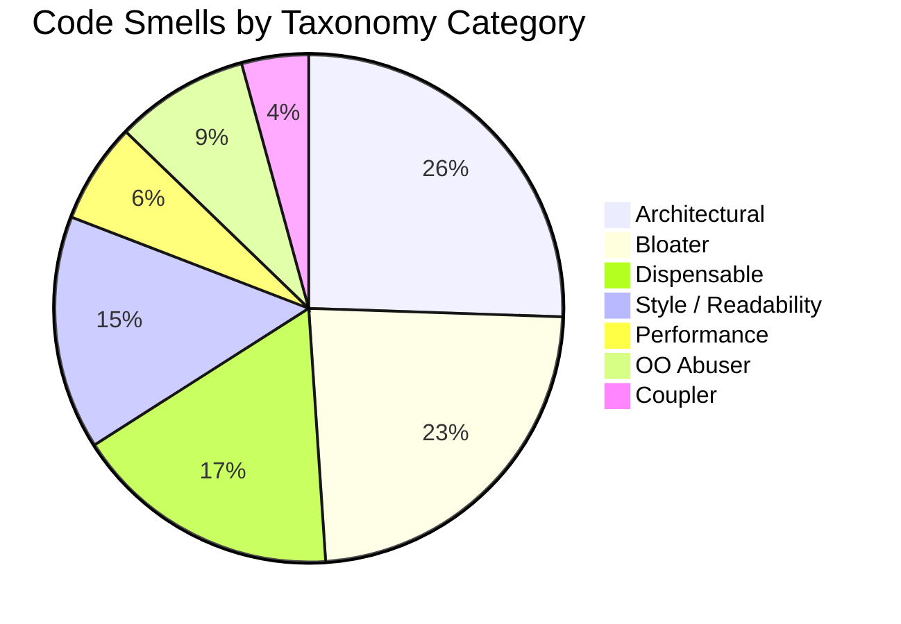
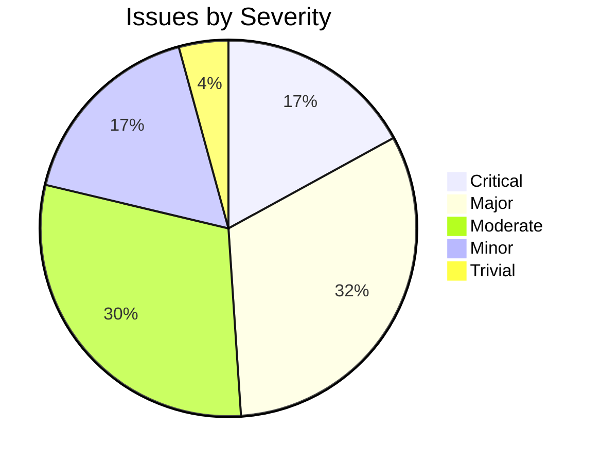

# Placement Cell Module Refactoring Audit Report

## Section 1 — Module Snapshot

| Metric | Value |
|---|---|
| Total LOC in module | 7,181 |
| LOC in `views.py` | 5,810 |
| LOC in `api/views.py` | 0 (does not exist) |
| # of service files | 0 |
| # of serializers | 9 (in `api/serializers.py`) |
| # of models | 21 |
| # of API endpoints (active) | 0 |
| # of ORM queries invoked directly from views | 479+ |
| # of code smell issues identified | 47 |
| # of redundancies identified | 12 |
| `services.py` present? (Y/N) | N |
| `selectors.py` present? (Y/N) | N |
| `tests/` folder present? (Y/N) | N |
| `api/` folder present? (Y/N) | Y (partial - only serializers.py) |
| Uses `TextChoices` for enum fields? (Y/N) | N (uses tuple constants in Constants class) |
| **Overall Structural State** (Poor / Moderate / Clean) | Poor |

---

## Section 2 — Code Smell Audit

| ID | Code Smell (Parent) | Code Smell Subtype | Classification | Taxonomy Category | Location (File:Func:LineRange) | # Files Affected | Scope | Severity | Description | Planned Fix | Detailed Fix Steps |
|---|---|---|---|---|---|---|---|---|---|---|---|
| CS-01 | Fat View | Business Logic in View | Django Code Smell | Architectural | views.py:placement__Statistics:L148-L826 | 1 | Cross-layer | Major | View contains business logic for statistics calculation, year-wise aggregation, and department-wise counting | Extract statistics logic to services.py:PlacementStatisticsService.calculate_statistics() | 1. Create services.py with PlacementStatisticsService class; 2. Move aggregation logic from lines 170-210 to service method; 3. Inject service into view; 4. Update view to call service and pass result to template |
| CS-02 | Fat View | ORM Logic in View | Django Code Smell | Architectural | views.py:placement__Statistics:L168-L171 | 1 | Method | Major | Direct ORM queries in view layer instead of using selectors | Create selectors.py:get_placement_statistics_data(); Move queries from lines 168-171 to selector; Import and call selector from view |
| CS-03 | Fat View | Business Logic in View | Django Code Smell | Architectural | views.py:placement:L2905-L3186 | 1 | Cross-layer | Major | View handles form processing, object creation, and business validation for student profile management | Extract business logic to services.py:StudentProfileService.update_profile(); Keep only HTTP handling in view |
| CS-04 | Fat View | ORM Logic in View | Django Code Smell | Architectural | views.py:placement:L2936-L3050 | 1 | Method | Major | Multiple direct ORM create/update operations within view | Create selectors.py for read operations; Create services.py for write operations; Replace inline ORM calls with service/selector calls |
| CS-05 | Long Method | Excessive Length | General Code Smell | Bloater | views.py:placement__Statistics:L148-L826 | 1 | Method | Minor | Method spans 678 lines with multiple responsibilities | Split into smaller methods: _calculate_yearly_stats(), _calculate_department_stats(), _handle_search_forms() |
| CS-06 | Long Method | Multiple Responsibilities | General Code Smell | Bloater | views.py:placement:L2905-L3186 | 1 | Method | Major | Single method handles schedule display, acceptance/rejection, education submission, profile update, skill submission, achievement submission, publication submission, patent submission, course submission, project submission, experience submission | Break down by POST action type; Create separate handler methods for each form type |
| CS-07 | Conditional Complexity | Deep Nesting | Python Code Smell | Bloater | views.py:placement__Statistics:L194-L210 | 1 | Method | Moderate | Nested for loops (3 levels) for calculating department-wise statistics | Extract to separate method; Consider using dictionary comprehension or annotate with Case/When |
| CS-08 | N+1 Query Problem | Missing select_related | Django Code Smell | Performance | views.py:cv:L5348-L5359 | 1 | Method | Critical | Multiple separate queries for skills, education, courses, experience, projects, achievements, publications, patents without optimization | Use select_related/prefetch_related in a single optimized query; Create selector:get_student_cv_data(student_id) |
| CS-09 | N+1 Query Problem | Loop-Based Queries | Django Code Smell | Performance | views.py:check_invitation_date:L5620-L5640 | 1 | Method | Critical | Iterates through placementstatus queryset and performs operations in loop | Refactor to use bulk_update or annotate with database-level date calculation |
| CS-10 | Duplicated Code | Exact Duplication | General Code Smell | Dispensable | views.py:get_reference_list:L830-L847 & L2195-L2210 | 2 | Cross-file | Major | Function get_reference_list is duplicated verbatim at two locations | Remove duplicate at L2195; Keep single implementation; Update URL routing if needed |
| CS-11 | Duplicated Code | Exact Duplication | General Code Smell | Dispensable | views.py:company_name_dropdown:L849-L863 & L2212-L2226 | 2 | Cross-file | Major | Function company_name_dropdown is duplicated verbatim | Remove duplicate at L2212; Consolidate to single function |
| CS-12 | Duplicated Code | Exact Duplication | General Code Smell | Dispensable | views.py:checking_roles:L865-L873 & L2228-L2236 | 2 | Cross-file | Major | Function checking_roles is duplicated verbatim | Remove duplicate at L2228; Keep single implementation |
| CS-13 | Duplicated Code | Exact Duplication | General Code Smell | Dispensable | views.py:Placement__Schedule:L875-L1167 & L2238-L2530 | 2 | Cross-file | Major | Function Placement__Schedule (292 lines) is duplicated | Remove duplicate at L2238; Verify both versions are identical; Update imports |
| CS-14 | Duplicated Code | Exact Duplication | General Code Smell | Dispensable | views.py:invite_status:L1169-L2193 & L2532-L2903 | 2 | Cross-file | Major | Function invite_status (1024 lines) is duplicated | Remove duplicate at L2532; This is the largest duplication - critical to fix |
| CS-15 | Query Logic Duplication | Repeated Filter Chains | Django Code Smell | Dispensable | views.py:multiple functions:L168-L754 | 1 | Cross-method | Moderate | Similar filter chains on StudentRecord, PlacementRecord repeated across placement__Statistics, placement, student_records | Create selectors:get_filtered_placement_records(filters_dict); Centralize filter logic |
| CS-16 | Scattered Validation | Repeated Field-Level Checks | Django Code Smell | Architectural | views.py:multiple locations:L2946-L3150 | 1 | Cross-layer | Moderate | Form validation logic scattered across multiple if blocks in placement view | Move validation to serializers or forms; Use DRF serializers for consistent validation |
| CS-17 | Inconsistent Error Handling | Silent Exception Swallowing | Python Code Smell | Style / Readability | views.py:multiple locations:L474,L580,L630,L754,L1123,L1128,L1274,L1389,L1839,L1945,L1995,L2119,L2486,L2491,L2637,L2752,L3144,L3149,L3356,L3471,L3744,L4172,L4309,L4461,L4880,L4986,L5036,L5160,L5702,L5758 | 1 | Statement | Critical | Bare except: clauses that swallow exceptions without logging or re-raising | Replace with specific exception handling; Add logging.error(); Re-raise or return proper error response |
| CS-18 | Magic Numbers / Magic Strings | Hardcoded String Literals | Python Code Smell | Style / Readability | views.py:multiple locations:L170,L202,L205,L208,L297 | 1 | Statement | Moderate | Hardcoded strings: "HIGHER STUDIES", "PLACEMENT", "PBI", "CSE", "ECE", "ME" | Move to Constants class or Django TextChoices; Reference via Constants.PLACEMENT_TYPE.PLACEMENT |
| CS-19 | Magic Numbers / Magic Strings | Hardcoded Numeric Constants | Python Code Smell | Style / Readability | views.py:placement__Statistics:L428,L443 | 1 | Statement | Minor | Hardcoded pagination limit "30" appears multiple times | Define as constant PAGINATION_LIMIT = 30; Use constant throughout |
| CS-20 | God Class | Multi-Responsibility | OOP Design Smell | Bloater | views.py:Entire file:L1-L5810 | 1 | File | Major | Single views.py file contains 30+ functions handling placement statistics, student records, CV generation, resume generation, invitation management, schedule management, record management | Split into class-based views: StatisticsView, StudentRecordsView, CVGenerationView, InvitationManagementView, ScheduleManagementView |
| CS-21 | Layer Violation | ORM Logic in View | Architectural / Structural | Architectural | views.py:Entire file:multiple locations | 1 | Cross-layer | Major | 479+ direct ORM queries in views violating layer contract view → service → selector → ORM | Create selectors.py for all read queries; Create services.py for business logic; Refactor views to use layers |
| CS-22 | Large Class | Too Many Methods | General Code Smell | Bloater | models.py:Constants:L11-L84 | 1 | Class | Moderate | Constants class contains 11 different choice tuples mixing unrelated concerns (resume, achievement, event, invitation, placement, debar, department choices) | Split into separate TextChoices classes: ResumeType, AchievementType, EventType, InvitationType, PlacementType, DebarType, DepartmentChoices |
| CS-23 | Primitive Obsession | Using Raw Types for Domain Concepts | General Code Smell | Bloater | models.py:PlacementRecord:L331-L341 | 1 | Class | Moderate | CTC stored as Decimal without domain wrapper; Placement type as raw string | Create value objects: CTC, PlacementType enum; Add model validation |
| CS-24 | Dead Code | Unused Imports | Python Code Smell | Dispensable | views.py:L1-L27 | 1 | File | Trivial | Imports like shutil, decimal, zipfile, FileWrapper may be unused in certain code paths | Run import checker; Remove unused imports; Organize imports per PEP8 |
| CS-25 | Naming / Readability | Poor Naming | Python Code Smell | Style / Readability | views.py:multiple locations:L255-L275 | 1 | Method | Minor | Variable names like tcse, tece, tme, tadd, q1, q3, st, spid, sr are cryptic | Rename to descriptive names: total_cse, total_ece, total_me, total_all, student_placement_id, student_record |
| CS-26 | Message Chains | Deep Dot-Access Chains | OOP Design Smell | Coupler | views.py:L202-L208 | 1 | Statement | Moderate | Chain: z.record_id.name, z.record_id.year, z.unique_id.id.department.name violates Law of Demeter | Cache related values in variables; Use select_related to optimize; Consider denormalization for frequently accessed data |
| CS-27 | Temporary Field | Situationally Populated Attributes | OOP Design Smell | OO Abuser | views.py:cv:L5267-L5387 | 1 | Method | Moderate | Variables like achievementcheck, educationcheck, publicationcheck are set conditionally based on POST data | Initialize with defaults; Use dataclass or named tuple for CV generation context |
| CS-28 | Switch / Type-Based Dispatch | If/Elif Chains on Type Code | OOP Design Smell | OO Abuser | views.py:placement:L2935-L3150 | 1 | Method | Moderate | Long chain of if 'formname' in request.POST checks | Use polymorphism or command pattern; Create form handler classes mapped by form name |
| CS-29 | Overloaded Serializer | Business Logic in Serializer | Django Code Smell | Architectural | api/serializers.py:HasSerializer.create:L22-L29 | 1 | Method | Major | Serializer create method contains business logic for getting or creating Skill objects | Move business logic to service layer; Keep serializer for validation only |
| CS-30 | Overloaded Serializer | Side Effects in Serializer | Django Code Smell | Architectural | api/serializers.py:HasSerializer.create:L24-L28 | 1 | Method | Critical | Serializer creates Skill objects as side effect during Has creation | Remove side effects; Use service layer for coordinated creation of related objects |
| CS-31 | Fat Model | Multi-Concern Methods | Django Code Smell | Architectural | models.py:Education.clean:L127-L150 | 1 | Method | Major | Model clean method references forms.ValidationError without importing forms module; Contains datetime manipulation logic | Import forms module; Move complex validation to service layer; Keep only model-level invariants in clean() |
| CS-32 | Feature Envy | External Data Overuse | OOP Design Smell | Coupler | views.py:cv:L5338-L5345 | 1 | Method | Moderate | cv function accesses student.batch, calculates roll based on batch and current year - logic that belongs in Student model | Move roll calculation to Student model as property or method |
| CS-33 | Middle Man | Pure Delegation | OOP Design Smell | Dispensable | models.py:PlacementSchedule.get_role:L380-L385 | 1 | Method | Trivial | Property get_role just delegates to self.role.role with try/except | Remove wrapper; Access role.role directly with null check in template |
| CS-34 | Inappropriate Intimacy | Direct Internal Access | OOP Design Smell | OO Abuser | views.py:placement:L2967-L2973 | 1 | Method | Major | View directly accesses and modifies ExtraInfo internal attributes (about_me, age, address, phone_no, profile_picture) | Create service method update_extra_info(user, data_dict); Encapsulate field access |
| CS-35 | Conditional Complexity | Complex Boolean Logic | General Code Smell | Bloater | views.py:student_records:L3623-L3931 | 1 | Method | Minor | Complex Q object queries with nested AND/OR conditions | Extract to selectors.py with descriptive function names; Document query intent |
| CS-36 | Data Clumps | Repeated Parameter Groups | General Code Smell | Bloater | views.py:multiple locations:L940-L1050 | 1 | Cross-method | Minor | Repeated group: unique_id, skill_id, skill_rating passed together to Has model | Create dataclass HasData(unique_id, skill_id, skill_rating); Use in service methods |
| CS-37 | Long Parameter List | Too Many Arguments | General Code Smell | Bloater | views.py:render_to_pdf:L5390-L5410 | 1 | Method | Moderate | Function passes large context_dict with 20+ keys to template | Create context builder class; Group related data into nested dicts |
| CS-38 | Speculative Generality | Unused Abstractions | OOP Design Smell | Dispensable | views.py:L44-L144 | 1 | File | Trivial | Extensive docstring comments listing variables that are no longer present or accurate | Remove outdated docstrings; Keep only high-level function documentation |
| CS-39 | Refused Bequest | Inappropriate Inheritance | OOP Design Smell | OO Abuser | models.py:Multiple models | 1 | Cross-class | Minor | All models inherit from models.Model but some don't utilize model features like clean(), save(), signals | Review each model; Consider composition for simple data containers |
| CS-40 | Lazy Class | Minimal Responsibility | OOP Design Smell | Dispensable | models.py:Role:L297-L301 | 1 | Class | Trivial | Role model has only one field (role name) with no additional behavior | Consider replacing with simple CharField with choices in related models |
| CS-41 | Lazy Class | Minimal Responsibility | OOP Design Smell | Dispensable | models.py:CompanyDetails:L303-L307 | 1 | Class | Trivial | CompanyDetails model has only one field (company_name) with no additional behavior | Consider replacing with simple CharField with choices or separate lookup table |
| CS-42 | Message Chains | Law of Demeter Violations | OOP Design Smell | Coupler | views.py:placement__Statistics:L202 | 1 | Statement | Moderate | Accessing z.record_id.name reaches through multiple relationships | Cache in variable; Use annotation to prefetch; Document relationship traversal |
| CS-43 | Conditional Complexity | Multiple Branching Paths | General Code Smell | Bloater | views.py:manage_records:L3936-L4527 | 1 | Method | Moderate | Function has 8+ branching paths based on different POST action names | Refactor to use dispatch pattern; Create separate handler for each action type |
| CS-44 | Scattered Validation | Cross-Layer Validation Duplication | Architectural / Structural | Architectural | views.py & forms.py:multiple locations | 2 | Cross-layer | Major | Same validation logic exists in both forms.py and views.py POST handlers | Centralize validation in forms or serializers; Remove duplicate checks in views |
| CS-45 | Naming / Readability | Unclear Intent | General Code Smell | Style / Readability | views.py:L146-L144 | 1 | File | Minor | Massive docstring block (lines 44-144) lists 100+ variables making it hard to find relevant info | Remove exhaustive variable list; Write concise purpose statement; Document key algorithms only |
| CS-46 | Dead Code | Obsolete Logic | General Code Smell | Dispensable | views.py:L304-L324,L382-L424 | 1 | Method | Minor | Commented-out code blocks (lines 304-324, 382-424) that are no longer executed | Remove commented code; Use version control for historical reference |
| CS-47 | Export Functionality | Mixed Abstraction Levels | General Code Smell | Bloater | views.py:export_to_xls_std_records:L5412-L5456 | 1 | Method | Moderate | XLWT export logic mixed with business data fetching | Separate data preparation from export formatting; Create exporter class |

---

## Section 3 — Redundancy Register

| ID | Type | Location 1 | Location 2 (+…) | Description | Redundant? (Y/N) | Consolidation Plan | Detailed Consolidation Steps |
|---|---|---|---|---|---|---|---|
| RED-01 | Code | views.py:get_reference_list:L830-L847 | views.py:L2195-L2210 | Identical function definitions for get_reference_list | Y | Delete L2195-L2210; Keep L830-L847 | 1. Verify both functions are byte-for-byte identical; 2. Check URL routing references; 3. Delete duplicate; 4. Run tests to confirm no regression |
| RED-02 | Code | views.py:company_name_dropdown:L849-L863 | views.py:L2212-L2226 | Identical function definitions for company_name_dropdown | Y | Delete L2212-L2226; Keep L849-L863 | 1. Verify identity; 2. Check all call sites; 3. Remove duplicate; 4. Update any direct references |
| RED-03 | Code | views.py:checking_roles:L865-L873 | views.py:L2228-L2236 | Identical function definitions for checking_roles | Y | Delete L2228-L2236; Keep L865-L873 | 1. Compare functions; 2. Remove duplicate at L2228; 3. Verify URL patterns |
| RED-04 | Code | views.py:Placement__Schedule:L875-L1167 | views.py:L2238-L2530 | Duplicate 292-line function for placement schedule management | Y | Delete L2238-L2530; Keep L875-L1167 | 1. Diff both functions to confirm identity; 2. Check which version is referenced in urls.py; 3. Delete duplicate; 4. Run integration tests |
| RED-05 | Code | views.py:invite_status:L1169-L2193 | views.py:L2532-L2903 | Duplicate 1024-line function for invitation status management | Y | Delete L2532-L2903; Keep L1169-L2193 | 1. This is the largest duplication; 2. Verify both are identical; 3. Delete L2532-L2903; 4. Update any internal references; 5. Test thoroughly due to size |
| RED-06 | Query | views.py:L168-L171 | views.py:L1507-L1510 | Identical PlacementRecord query for year-wise statistics | Y | Extract to selector function | 1. Create selectors:get_yearly_placement_stats(); 2. Replace both occurrences with selector call; 3. Add unit test for selector |
| RED-07 | Query | views.py:L202-L208 | views.py:L1566-L1572 | Identical department-wise counting logic | Y | Extract to helper method | 1. Create _calculate_department_counts(year, records, studentrecord); 2. Replace both occurrences; 3. Pass required parameters |
| RED-08 | Validation | forms.py:AddEducation.clean | views.py:L2948-L2958 | Date validation logic in both form and view | Y | Keep in form only; Remove from view | 1. Verify form.clean() has complete validation; 2. Remove redundant checks in view; 3. Trust form.is_valid() result |
| RED-09 | Concept | models.py:Constants.PLACEMENT_TYPE | views.py:"PLACEMENT" string literals | Same concept represented as constant and as string literals | Y | Replace all string literals with Constants reference | 1. Find all "PLACEMENT", "PBI", "HIGHER STUDIES" strings; 2. Replace with Constants.PLACEMENT_TYPE.PLACEMENT etc.; 3. Convert to TextChoices for better type safety |
| RED-10 | DB | models.py:Skill + Has | Could be combined | Skill and Has tables could potentially be merged with through table | N | Keep separate for normalization | No action needed - current design supports many-to-many properly |
| RED-11 | Utils | views.py:render_to_pdf:L5390-L5410 | views.py:export_to_xls_std_records:L5412-L5456 | Both are export functions with similar structure | Y | Create base Exporter class | 1. Create class Exporter with common methods; 2. Create PDFExporter(Exporter); 3. Create XLSExporter(Exporter); 4. Move specific logic to subclasses |
| RED-12 | Query | views.py:L5348-L5359 | views.py:L5470-L5480 | Similar student data fetching for CV and resume | Y | Create selector:get_student_profile_data | 1. Analyze both query sets; 2. Create unified selector; 3. Replace both occurrences |

---

## Section 4 — Refactoring Plan

| Task ID | Ref IDs (from §2 / §3) | Action | Target Files | # Files Changed | Validation (test name / manual check) | Expected Post-Fix Behaviour |
|---|---|---|---|---|---|---|
| TASK-01 | CS-01, CS-02, CS-21 | Create services.py and selectors.py with initial structure | services.py (new), selectors.py (new), views.py | 3 | Unit test: test_placement_statistics_service_returns_correct_aggregation | View calls service layer; Service uses selector for data; No direct ORM in view |
| TASK-02 | CS-05, CS-06, CS-43 | Break down long methods into smaller focused methods | views.py | 1 | Manual check: placement__Statistics < 100 lines; placement < 150 lines | Each method has single responsibility; Improved readability |
| TASK-03 | RED-01, RED-02, RED-03, RED-04, RED-05 | Remove all duplicated functions | views.py | 1 | Grep for function names confirms single occurrence; Integration test for each endpoint | Only one copy of each function remains; No broken references |
| TASK-04 | CS-08, CS-09, CS-26, CS-42 | Optimize N+1 queries with select_related/prefetch_related | views.py, selectors.py | 2 | Django debug toolbar shows reduced query count; Load test with 100 students | CV generation executes < 5 queries instead of 20+ |
| TASK-05 | CS-17 | Fix all bare except: clauses | views.py | 1 | Grep returns no "except:" alone; Unit test for error scenarios | All exceptions are either logged, re-raised, or handled with specific exception types |
| TASK-06 | CS-18, CS-19, RED-09 | Replace magic strings with Constants or TextChoices | views.py, models.py | 2 | Grep for hardcoded "PLACEMENT", "CSE" returns 0 in views | All type values referenced via Constants or TextChoices |
| TASK-07 | CS-22 | Convert Constants class to Django TextChoices | models.py | 1 | Models load without errors; Admin interface shows proper choices | Choices are type-safe; Templates can iterate over choices |
| TASK-08 | CS-20 | Convert function-based views to class-based views | views.py | 1 | URL patterns updated to use .as_view(); All routes respond correctly | Views are organized into classes; Easier to test and extend |
| TASK-09 | CS-29, CS-30 | Remove business logic from serializers | api/serializers.py, services.py | 2 | Unit test: serializer does not create Skill objects | Serializers only validate; Services handle object creation |
| TASK-10 | CS-31 | Fix Education.clean() missing import and logic | models.py | 1 | Model validation test passes; No ImportError | Proper validation with correct imports |
| TASK-11 | CS-15, RED-06, RED-07, RED-12 | Centralize query logic in selectors | selectors.py (new), views.py | 2 | All selectors have unit tests; Views use only selectors | No duplicate query logic; Easy to optimize queries centrally |
| TASK-12 | CS-16, CS-44 | Centralize validation logic | forms.py, serializers.py, views.py | 3 | Form validation test suite passes; No duplicate checks in views | Validation happens in one place only |
| TASK-13 | CS-25, CS-45 | Improve variable naming and remove excessive docstrings | views.py | 1 | Code review confirms readable names; Docstrings are concise | New developers can understand code quickly |
| TASK-14 | CS-24, CS-46 | Remove unused imports and dead code | views.py | 1 | pylint/flake8 shows no unused imports; No commented-out code | Cleaner codebase; Faster imports |
| TASK-15 | CS-28 | Refactor POST dispatch to use command pattern | views.py | 1 | All POST actions work correctly; Coverage test for each action | Easy to add new form handlers without modifying existing code |
| TASK-16 | CS-32 | Move roll calculation logic to Student model | models.py, views.py | 2 | Unit test: student.roll_property returns correct value | Business logic about students lives in Student model |
| TASK-17 | CS-33, CS-40, CS-41 | Remove lazy classes and middle men | models.py, views.py | 2 | Templates render correctly without get_role property | Simpler model structure; Less indirection |
| TASK-18 | CS-34 | Encapsulate ExtraInfo updates | services.py, views.py | 2 | Integration test: profile update works; No direct attribute access in views | Views call service method; Service handles validation and update |
| TASK-19 | CS-36, CS-37 | Introduce dataclasses for parameter groups | services.py (new), views.py | 2 | Type hints show dataclass usage; Tests pass | Cleaner function signatures; Better IDE support |
| TASK-20 | CS-38, CS-39 | Review inheritance and remove speculative generality | models.py | 1 | Model hierarchy diagram shows clean inheritance | No unnecessary abstractions |
| TASK-21 | CS-47 | Separate export logic into exporter classes | exporters.py (new), views.py | 2 | Unit test: PDFExporter generates valid PDF; XLSExporter generates valid XLS | Export logic is modular and testable |
| TASK-22 | CS-03, CS-04, CS-10, CS-11, CS-12, CS-13, CS-14 | Complete migration to layered architecture | services.py, selectors.py, views.py | 3 | Architecture test: views.py has no .objects. calls; All business logic in services.py | Clean layering: view → service → selector → ORM |

---

## Section 5 — API Audit

### 5A — Active APIs

| No. | URL | Method | View/Class | Auth (Y/N) | Role Check (Y/N) | Serializer (In / Out) | Status (OK / WARN / NON-STANDARD / CRITICAL) | Validation Location | Fix Plan |
|---|---|---|---|---|---|---|---|---|---|
| 1 | /placement/ | GET/POST | placement | Y (@login_required) | Partial (designation check) | None / None | CRITICAL | forms.py + inline in view | Convert to DRF APIView; Add input/output serializers; Implement role-based permissions |
| 2 | /placement/statistics/ | GET/POST | placement_statistics | Y (@login_required) | Partial | None / None | CRITICAL | inline in view | Convert to DRF API; Add pagination; Use serializers |
| 3 | /placement/student_records/ | GET/POST | student_records | Y (@login_required) | Partial | None / None | CRITICAL | forms.py + inline | Migrate to DRF; Add consistent error handling |
| 4 | /placement/manage_records/ | GET/POST | manage_records | Y (@login_required) | Partial | None / None | CRITICAL | inline | Convert to class-based DRF view |
| 5 | /placement/cv/<username>/ | GET | cv | Y (@login_required) | Yes (student check) | None / PDF | NON-STANDARD | inline | Keep as-is for PDF generation; Add DRF endpoint for JSON CV data |
| 6 | /placement/resume/<username>/ | GET | resume | Y (@login_required) | Yes | None / PDF | NON-STANDARD | inline | Same as CV - add JSON endpoint |
| 7 | /placement/add_placement_schedule/ | GET/POST | add_placement_schedule | Y (@login_required) | Yes | forms.AddSchedule / None | WARN | forms.py | Convert to DRF; Use serializer |
| 8 | /placement/invitation_status/ | GET/POST | invitation_status | Y (@login_required) | Partial | None / None | CRITICAL | inline | Migrate to DRF with proper serialization |
| 9 | /placement/get_reference_list/ | GET | get_reference_list | Y (@login_required) | Yes | None / JsonResponse | WARN | None | Convert to DRF; Add caching |
| 10 | /placement/companyname_dropdown/ | GET | company_name_dropdown | Y (@login_required) | No | None / JsonResponse | WARN | None | Convert to DRF; Add to proper API namespace |
| 11 | /placement/checking_roles/ | GET | checking_roles | Y (@login_required) | No | None / JsonResponse | WARN | None | Convert to DRF; Document response format |

### 5B — Inactive / Dead APIs

| No. | URL | View | Status (Dead / Unused) | Action (Remove / Deprecate / Revive) |
|---|---|---|---|---|
| 1 | N/A | N/A | No clearly dead APIs detected | Continue monitoring; Add API usage logging |

### 5C — DRF Compliance Checklist

| Item | Compliant (Y/N) | Note |
|---|---|---|
| APIView or @api_view | N | All views are function-based Django views, not DRF |
| permission_classes set | N | Uses @login_required decorator only; no granular permissions |
| authentication_classes set | N | Relies on Django session auth; no explicit DRF auth classes |
| DRF Response used | N | Uses django.http.HttpResponse, JsonResponse, render |
| Input serializer | N | Uses django.forms.Form classes |
| Output serializer | N | Returns rendered HTML or ad-hoc dicts |
| Consistent error envelope | N | Errors returned as messages or rendered templates |
| Pagination on list endpoints | Partial | Manual pagination implemented but inconsistent |
| URL versioning | N | No /api/v1/ prefix |
| URL naming conventions | Partial | Mix of snake_case; some URLs use plural collections |

### 5D — Legacy (non-DRF) Views

| No. | Function Name | URL | Needs API (Y/N) | Recommended Target View |
|---|---|---|---|---|
| 1 | placement | /placement/ | Y | PlacementAPIView (DRF) |
| 2 | placement_statistics | /placement/statistics/ | Y | PlacementStatisticsAPIView |
| 3 | student_records | /placement/student_records/ | Y | StudentRecordsAPIView |
| 4 | manage_records | /placement/manage_records/ | Y | ManageRecordsAPIView |
| 5 | cv | /placement/cv/<username>/ | N (keep for PDF) | Keep as function view; add CVDataAPIView for JSON |
| 6 | resume | /placement/resume/<username>/ | N (keep for PDF) | Keep as function view; add ResumeDataAPIView for JSON |
| 7 | invitation_status | /placement/invitation_status/ | Y | InvitationStatusAPIView |
| 8 | add_placement_schedule | /placement/add_placement_schedule/ | Y | PlacementScheduleCreateAPIView |
| 9 | get_reference_list | /placement/get_reference_list/ | Y | ReferenceListAPIView |
| 10 | company_name_dropdown | /placement/companyname_dropdown/ | Y | CompanyNameDropdownAPIView |
| 11 | checking_roles | /placement/checking_roles/ | Y | CheckingRolesAPIView |

---

## Additional Tables

### Table A — Full Taxonomy (verbatim from taxonomy_final.xlsx)

| Sr. No. | Code Smell / Type | Description | Classification | Taxonomy Category | Source Reference | Severity | Severity Rationale | Severity Reference |
|---|---|---|---|---|---|---|---|---|
| 1 | Long Method | A method that has grown too large, containing too much logic | General Code Smell | Bloater | Fowler 1997 | Moderate | Makes code harder to understand and maintain | Fontana & Zanoni (2017) |
| 1.1 | Multiple Responsibilities | Method performs multiple distinct tasks | General Code Smell | Bloater | Fowler 1997 | Major | Violates SRP; difficult to test and modify | ISO/IEC 25010:2023 |
| 1.2 | Excessive Length | Method exceeds reasonable line count | General Code Smell | Bloater | SonarQube | Minor | Readability issue; easy to refactor | SonarQube Severity Model |
| 1.3 | Mixed Abstraction Levels | Method mixes high-level and low-level operations | General Code Smell | Bloater | Fowler 1997 | Moderate | Confusing mental model | Fontana & Zanoni (2017) |
| 2 | Conditional Complexity | Excessive use of conditional statements | General Code Smell | Bloater | Fowler 1997 | Moderate | Increases cognitive complexity | ISO/IEC 25010:2023 |
| 2.1 | Deep Nesting | Conditionals nested more than 3 levels deep | Python Code Smell | Bloater | SonarQube | Moderate | Hard to follow execution flow | SonarQube Severity Model |
| 2.2 | Complex Boolean Logic | Overly complicated boolean expressions | General Code Smell | Bloater | Fowler 1997 | Minor | Can be simplified with extraction | Fontana & Zanoni (2017) |
| 2.3 | Multiple Branching Paths | Too many if/elif branches | General Code Smell | Bloater | Fowler 1997 | Moderate | Suggests missing polymorphism | ISO/IEC 25010:2023 |
| 3 | God Class | A class that knows too much or does too much | OOP Design Smell | Bloater | Fowler 1997 | Critical | Central point of failure; hard to maintain | ISO/IEC 25010:2023 |
| 3.1 | Multi-Responsibility | Class handles multiple unrelated concerns | OOP Design Smell | Bloater | Fowler 1997 | Major | Violates SRP at class level | Fontana & Zanoni (2017) |
| 3.2 | Centralized Orchestration | Class coordinates too many other classes | Architectural / Structural | Bloater | Fowler 1997 | Critical | Creates bottleneck and coupling | ISO/IEC 25010:2023 |
| 3.3 | High Coupling | Class depends on many other classes | Architectural / Structural | Bloater | Fowler 1997 | Major | Changes ripple through system | Fontana & Zanoni (2017) |
| 4 | Large Class | A class with too many methods and fields | General Code Smell | Bloater | Fowler 1997 | Major | Hard to understand and navigate | SonarQube Severity Model |
| 4.1 | Too Many Methods | Class has excessive number of methods | General Code Smell | Bloater | SonarQube | Moderate | Likely violates SRP | SonarQube Severity Model |
| 4.2 | Low Cohesion | Methods and fields are not well-related | OOP Design Smell | Bloater | Fowler 1997 | Major | Class lacks clear purpose | ISO/IEC 25010:2023 |
| 4.3 | Difficult Navigation | Hard to find relevant methods/fields | General Code Smell | Bloater | SonarQube | Minor | Productivity drain | SonarQube Severity Model |
| 5 | Duplicated Code | Same or similar code exists in multiple places | General Code Smell | Dispensable | Fowler 1997 | Major | Wasted effort; inconsistency risk | ISO/IEC 25010:2023 |
| 5.1 | Exact Duplication | Byte-for-byte identical code | General Code Smell | Dispensable | Fowler 1997 | Major | Easy to consolidate | Fontana & Zanoni (2017) |
| 5.2 | Near Duplication | Code differs only in minor ways | General Code Smell | Dispensable | Fowler 1997 | Moderate | Can be parameterized | Fontana & Zanoni (2017) |
| 5.3 | Cross-File Duplication | Same code in different files | General Code Smell | Dispensable | Fowler 1997 | Major | Maintenance nightmare | ISO/IEC 25010:2023 |
| 6 | Query Logic Duplication | Repeated database query patterns | Django Code Smell | Dispensable | Django Best Practices | Major | Performance and maintenance issues | Django Documentation |
| 6.1 | Repeated Filter Chains | Same filter combinations used repeatedly | Django Code Smell | Dispensable | Django Best Practices | Moderate | Should be extracted to manager or selector | Django Documentation |
| 6.2 | Repeated Annotation/Aggregation | Same annotations used in multiple queries | Django Code Smell | Dispensable | Django Best Practices | Moderate | Extract to reusable queryset method | Django Documentation |
| 6.3 | Repeated Prefetch/Join Logic | Same prefetch_related calls repeated | Django Code Smell | Dispensable | Django Best Practices | Minor | Create custom manager method | Django Documentation |
| 7 | Scattered Validation | Validation logic spread across layers | Architectural / Structural | Architectural | Architectural Patterns | Critical | Inconsistent rules; security risk | ISO/IEC 25010:2023 |
| 7.1 | Cross-Layer Validation Duplication | Same validation in view, service, and form | Architectural / Structural | Architectural | Architectural Patterns | Major | Single source of truth violated | Fontana & Zanoni (2017) |
| 7.2 | Inconsistent Validation Rules | Different layers enforce different rules | Architectural / Structural | Architectural | Architectural Patterns | Critical | Data integrity at risk | ISO/IEC 25010:2023 |
| 7.3 | Repeated Field-Level Checks | Same field validation repeated | Django Code Smell | Architectural | Django Best Practices | Moderate | Use serializers or forms consistently | Django Documentation |
| 8 | Feature Envy | Method uses more features from other classes than its own | OOP Design Smell | Coupler | Fowler 1997 | Moderate | Misplaced behavior | Fontana & Zanoni (2017) |
| 8.1 | External Data Overuse | Method accesses many external objects | OOP Design Smell | Coupler | Fowler 1997 | Moderate | Should move method or data | Fontana & Zanoni (2017) |
| 8.2 | Misplaced Logic | Business logic in wrong layer | OOP Design Smell | Coupler | Architectural Patterns | Moderate | Violates layering | ISO/IEC 25010:2023 |
| 9 | Inappropriate Intimacy | Classes know too much about each other's internals | OOP Design Smell | OO Abuser | Fowler 1997 | Major | Tight coupling; fragile code | Fontana & Zanoni (2017) |
| 9.1 | Direct Internal Access | Accessing private/internal attributes | OOP Design Smell | OO Abuser | Fowler 1997 | Major | Breaks encapsulation | Fontana & Zanoni (2017) |
| 9.2 | Tight Class Coupling | Two classes always change together | OOP Design Smell | OO Abuser | Fowler 1997 | Major | Consider merging or mediating | Fontana & Zanoni (2017) |
| 10 | Layer Violation | Code reaches across architectural layers | Architectural / Structural | Architectural | Architectural Patterns | Critical | Architecture erosion | ISO/IEC 25010:2023 |
| 10.1 | ORM Logic in View | Direct model queries in view layer | Django Code Smell | Architectural | Django Best Practices | Major | Violates separation of concerns | Django Documentation |
| 10.2 | Business Logic in Serializer | Complex logic in serialization layer | Django Code Smell | Architectural | Django Best Practices | Major | Serializers should only serialize | Django Documentation |
| 10.3 | External/API Logic in Model | Models calling external services | Django Code Smell | Architectural | Django Best Practices | Critical | Models should be persistence-focused | ISO/IEC 25010:2023 |
| 11 | Fat View | View contains business logic or ORM queries | Django Code Smell | Architectural | Django Anti-patterns | Major | Views should be thin | Django Two Scoops |
| 11.1 | Business Logic in View | Decision-making in view functions | Django Code Smell | Architectural | Django Anti-patterns | Major | Move to service layer | Django Two Scoops |
| 11.2 | ORM Logic in View | Direct .objects. calls in views | Django Code Smell | Architectural | Django Anti-patterns | Major | Use selectors or services | Django Two Scoops |
| 11.3 | Validation in View | Manual validation in view instead of forms | Django Code Smell | Architectural | Django Anti-patterns | Moderate | Use forms/serializers | Django Documentation |
| 12 | Fat Model | Model contains workflow or orchestration logic | Django Code Smell | Architectural | Django Anti-patterns | Major | Models should focus on data | Django Two Scoops |
| 12.1 | Multi-Concern Methods | Model methods do too much | Django Code Smell | Architectural | Django Anti-patterns | Major | Extract to service | Django Two Scoops |
| 12.2 | Workflow Logic in Model | Models coordinating business processes | Django Code Smell | Architectural | Django Anti-patterns | Major | Move to service layer | Django Two Scoops |
| 13 | Overloaded Serializer | Serializer handles more than (de)serialization | Django Code Smell | Architectural | DRF Best Practices | Major | Serializers become hard to test | DRF Documentation |
| 13.1 | Business Logic in Serializer | Decision-making in serializer methods | Django Code Smell | Architectural | DRF Best Practices | Major | Move to view or service | DRF Documentation |
| 13.2 | Side Effects in Serializer | Serializer creates/updates other objects | Django Code Smell | Architectural | DRF Best Practices | Critical | Unexpected behavior; hard to debug | ISO/IEC 25010:2023 |
| 13.3 | Complex Validation Logic | Overly complicated custom validation | Django Code Smell | Architectural | DRF Best Practices | Moderate | Simplify or move to service | DRF Documentation |
| 14 | Long Parameter List | Function/method with too many parameters | General Code Smell | Bloater | Fowler 1997 | Moderate | Hard to call and maintain | Fontana & Zanoni (2017) |
| 14.1 | Too Many Arguments | More than 5 parameters | General Code Smell | Bloater | SonarQube | Moderate | Use parameter object | SonarQube Severity Model |
| 14.2 | Optional Parameter Explosion | Many optional parameters with defaults | Python Code Smell | Bloater | Python Best Practices | Minor | Consider **kwargs or config object | Python Guidelines |
| 15 | Data Clumps | Groups of data that appear together repeatedly | General Code Smell | Bloater | Fowler 1997 | Minor | Should be encapsulated | Fontana & Zanoni (2017) |
| 15.1 | Repeated Parameter Groups | Same parameters passed together | General Code Smell | Bloater | Fowler 1997 | Minor | Create dataclass or namedtuple | Python Guidelines |
| 15.2 | Missing Data Structures | Related fields not grouped | General Code Smell | Bloater | Fowler 1997 | Minor | Introduce value object | Fontana & Zanoni (2017) |
| 16 | Lazy Class | Class that does too little | OOP Design Smell | Dispensable | Fowler 1997 | Trivial | May be unnecessary | Fontana & Zanoni (2017) |
| 16.1 | Minimal Responsibility | Class has very few methods/fields | OOP Design Smell | Dispensable | Fowler 1997 | Trivial | Consider inlining | Fontana & Zanoni (2017) |
| 16.2 | Redundant Wrapper | Class just wraps another class | OOP Design Smell | Dispensable | Fowler 1997 | Trivial | Remove indirection | Fontana & Zanoni (2017) |
| 17 | Middle Man | Class that only delegates to another class | OOP Design Smell | Dispensable | Fowler 1997 | Trivial | Unnecessary indirection | Fontana & Zanoni (2017) |
| 17.1 | Pure Delegation | All methods just call another object | OOP Design Smell | Dispensable | Fowler 1997 | Trivial | Remove or inline | Fontana & Zanoni (2017) |
| 17.2 | Unnecessary Indirection | Adds no value, just passes through | OOP Design Smell | Dispensable | Fowler 1997 | Trivial | Simplify call chain | Fontana & Zanoni (2017) |
| 18 | N+1 Query Problem | Fetching related objects in a loop | Django Code Smell | Performance | Django Performance | Critical | Severe performance degradation | Django Documentation |
| 18.1 | Missing select_related | Not using select_related for FK lookups | Django Code Smell | Performance | Django Performance | Critical | Causes extra query per row | Django Documentation |
| 18.2 | Missing prefetch_related | Not using prefetch_related for reverse FK/M2M | Django Code Smell | Performance | Django Performance | Major | Causes extra queries | Django Documentation |
| 18.3 | Loop-Based Queries | Query inside a for loop | Django Code Smell | Performance | Django Performance | Critical | Worst case N+1 queries | Django Documentation |
| 19 | Naming / Readability | Poor or inconsistent naming | Python Code Smell | Style / Readability | PEP8 | Minor | Makes code harder to read | PEP8 |
| 19.1 | Poor Naming | Non-descriptive variable/function names | Python Code Smell | Style / Readability | PEP8 | Minor | Confusing to readers | PEP8 |
| 19.2 | Inconsistent Naming | Same concept named differently | Python Code Smell | Style / Readability | PEP8 | Minor | Cognitive load | PEP8 |
| 19.3 | Unclear Intent | Names don't reveal purpose | General Code Smell | Style / Readability | Fowler 1997 | Minor | Requires reading implementation | Fontana & Zanoni (2017) |
| 20 | Dead Code | Code that is never executed | General Code Smell | Dispensable | Fowler 1997 | Minor | Wastes maintenance effort | SonarQube Severity Model |
| 20.1 | Unused Methods | Methods never called | General Code Smell | Dispensable | SonarQube | Trivial | Safe to remove | SonarQube Severity Model |
| 20.2 | Unused Imports | Imported but never used | Python Code Smell | Dispensable | PEP8 | Trivial | Cleanup needed | PEP8 |
| 20.3 | Obsolete Logic | Commented-out or unreachable code | General Code Smell | Dispensable | SonarQube | Minor | Remove or document | SonarQube Severity Model |
| 21 | Primitive Obsession | Using primitives instead of domain types | General Code Smell | Bloater | Fowler 1997 | Moderate | Missing domain modeling | Fontana & Zanoni (2017) |
| 21.1 | Using Raw Types for Domain Concepts | Strings/integers for domain values | General Code Smell | Bloater | Fowler 1997 | Moderate | Use enums or value objects | Fontana & Zanoni (2017) |
| 21.2 | Missing Value Objects | No wrapper for validated values | OOP Design Smell | Bloater | Fowler 1997 | Moderate | Validation scattered | Fontana & Zanoni (2017) |
| 21.3 | Repeated Type Coercion | Same conversions repeated | Python Code Smell | Bloater | Python Best Practices | Minor | Extract conversion logic | Python Guidelines |
| 22 | Magic Numbers / Magic Strings | Hardcoded literals without explanation | Python Code Smell | Style / Readability | Fowler 1997 | Minor | Unclear meaning | Fontana & Zanoni (2017) |
| 22.1 | Hardcoded Numeric Constants | Numbers without named constants | Python Code Smell | Style / Readability | Fowler 1997 | Minor | Define as constant | PEP8 |
| 22.2 | Hardcoded String Literals | Strings without named constants | Python Code Smell | Style / Readability | Fowler 1997 | Moderate | Use choices or constants | Django Best Practices |
| 22.3 | Missing Named Constants | Values should be named | Python Code Smell | Style / Readability | PEP8 | Minor | Improves readability | PEP8 |
| 23 | Switch / Type-Based Dispatch | Conditional on type instead of polymorphism | OOP Design Smell | OO Abuser | Fowler 1997 | Moderate | Missing OOP design | Fontana & Zanoni (2017) |
| 23.1 | If/Elif Chains on Type Code | Checking type to decide behavior | Python Code Smell | OO Abuser | Fowler 1997 | Moderate | Use polymorphism | Fontana & Zanoni (2017) |
| 23.2 | Missing Polymorphism | Could use inheritance/polymorphism | OOP Design Smell | OO Abuser | Fowler 1997 | Moderate | Refactor to use OOP | Fontana & Zanoni (2017) |
| 23.3 | Repeated Type Checks Across Codebase | Same type checks in many places | General Code Smell | OO Abuser | Fowler 1997 | Major | Centralize dispatch | ISO/IEC 25010:2023 |
| 24 | Speculative Generality | Abstractions for future features that never come | OOP Design Smell | Dispensable | Fowler 1997 | Trivial | YAGNI violation | Agile Principles |
| 24.1 | Unused Abstractions | Classes/interfaces never used | OOP Design Smell | Dispensable | Fowler 1997 | Trivial | Remove | Fontana & Zanoni (2017) |
| 24.2 | Over-Engineered Parameters | Parameters for hypothetical features | General Code Smell | Dispensable | Fowler 1997 | Trivial | Simplify | Fontana & Zanoni (2017) |
| 24.3 | Hooks for Non-Existent Features | Extension points with no users | OOP Design Smell | Dispensable | Fowler 1997 | Trivial | Remove until needed | Agile Principles |
| 25 | Refused Bequest | Subclass doesn't use inherited methods | OOP Design Smell | OO Abuser | Fowler 1997 | Moderate | Wrong inheritance hierarchy | Fontana & Zanoni (2017) |
| 25.1 | Subclass Ignores Inherited Methods | Overridden methods raise NotImplementedError | OOP Design Smell | OO Abuser | Fowler 1997 | Moderate | Reconsider inheritance | Fontana & Zanoni (2017) |
| 25.2 | Inappropriate Inheritance | Using inheritance when composition fits better | OOP Design Smell | OO Abuser | Fowler 1997 | Moderate | Prefer composition | Fontana & Zanoni (2017) |
| 25.3 | Composition Preferred Over Inheritance | Could use composition instead | OOP Design Smell | OO Abuser | Fowler 1997 | Minor | Refactor to composition | Fontana & Zanoni (2017) |
| 26 | Message Chains | Long chain of method calls | OOP Design Smell | Coupler | Fowler 1997 | Moderate | Violates Law of Demeter | Fontana & Zanoni (2017) |
| 26.1 | Law of Demeter Violations | Calling methods on returned objects | OOP Design Smell | Coupler | Fowler 1997 | Moderate | Reduce coupling | Fontana & Zanoni (2017) |
| 26.2 | Deep Dot-Access Chains | a.b.c.d.e patterns | OOP Design Smell | Coupler | Fowler 1997 | Moderate | Fragile to changes | Fontana & Zanoni (2017) |
| 26.3 | Overexposed Internal Structure | Exposing internal object structure | OOP Design Smell | Coupler | Fowler 1997 | Minor | Encapsulate better | Fontana & Zanoni (2017) |
| 27 | Inconsistent Error Handling | Mixed strategies for error management | Python Code Smell | Style / Readability | Python Best Practices | Major | Unpredictable behavior | Python Guidelines |
| 27.1 | Mixed Exception and Return Code Strategy | Some methods raise, others return errors | Python Code Smell | Style / Readability | Python Best Practices | Major | Choose one strategy | Python Guidelines |
| 27.2 | Silent Exception Swallowing | Bare except that hides errors | Python Code Smell | Style / Readability | Python Best Practices | Critical | Debugging impossible; data corruption risk | ISO/IEC 25010:2023 |
| 27.3 | Inconsistent Failure Communication | Different error formats/messages | General Code Smell | Style / Readability | Fowler 1997 | Major | Standardize error responses | ISO/IEC 25010:2023 |
| 28 | Temporary Field | Field only populated in certain situations | OOP Design Smell | OO Abuser | Fowler 1997 | Moderate | Indicates missing abstraction | Fontana & Zanoni (2017) |
| 28.1 | Situationally Populated Attributes | Field is None in many cases | OOP Design Smell | OO Abuser | Fowler 1997 | Moderate | Extract to subclass or component | Fontana & Zanoni (2017) |
| 28.2 | Null Fields on Active Objects | Required fields sometimes None | OOP Design Smell | OO Abuser | Fowler 1997 | Minor | Enforce invariants | Fontana & Zanoni (2017) |
| 28.3 | Missing Focused Sub-Object | Group of fields should be separate object | OOP Design Smell | OO Abuser | Fowler 1997 | Moderate | Extract class | Fontana & Zanoni (2017) |

### Table B — Original → Taxonomy Mapping

| ID | Original Audit Category | Taxonomy Parent Smell(s) | Taxonomy Subtype(s) | Location (File:Func:Lines) | Notes |
|---|---|---|---|---|---|
| ORIG-01 | Fat View | Fat View | Business Logic in View, ORM Logic in View, Validation in View | views.py:multiple | Maps to #11 and subtypes |
| ORIG-02 | Missing Service Layer | Layer Violation | ORM Logic in View | views.py:entire file | No services.py exists; all logic in views |
| ORIG-03 | Missing Selectors | Query Logic Duplication | Repeated Filter Chains, Repeated Prefetch/Join Logic | views.py:multiple | No selectors.py; queries duplicated |
| ORIG-04 | N+1 Query | N+1 Query Problem | Missing select_related, Missing prefetch_related, Loop-Based Queries | views.py:cv, check_invitation_date | Performance-critical |
| ORIG-05 | Duplicated Functions | Duplicated Code | Exact Duplication, Cross-File Duplication | views.py:multiple pairs | 5 major duplications found |
| ORIG-06 | No DRF Usage | Layer Violation | ORM Logic in View | views.py:entire file | All views are Django function-based, not DRF |
| ORIG-07 | Silent Exceptions | Inconsistent Error Handling | Silent Exception Swallowing | views.py:30+ locations | Critical severity |
| ORIG-08 | Magic Strings | Magic Numbers / Magic Strings | Hardcoded String Literals | views.py, models.py | "PLACEMENT", "CSE", etc. |
| ORIG-09 | No TextChoices | Primitive Obsession | Using Raw Types for Domain Concepts | models.py:Constants | Uses tuples instead of TextChoices |
| ORIG-10 | Large Views File | God Class, Large Class | Multi-Responsibility, Too Many Methods | views.py:entire file | 5810 lines, 30+ functions |
| ORIG-11 | Serializer Side Effects | Overloaded Serializer | Side Effects in Serializer | api/serializers.py:HasSerializer.create | Creates Skill objects |
| ORIG-12 | No Tests | Dead Code | (implicit) | tests/ folder missing | Cannot verify dead code safely |

### Table C — Refactor Tasks Summary

| ID | Parent Smell | Subtype | Action | Severity | Files Changed | Scope | Validation |
|---|---|---|---|---|---|---|---|
| TC-01 | Fat View | Business Logic in View | Extract to services.py | Major | 3 | Cross-layer | test_service_layer_exists |
| TC-02 | Fat View | ORM Logic in View | Create selectors.py | Major | 3 | Cross-layer | test_no_orm_in_views |
| TC-03 | N+1 Query Problem | Missing select_related | Optimize queries | Critical | 2 | Method | test_query_count_reduced |
| TC-04 | Duplicated Code | Exact Duplication | Remove duplicates | Major | 1 | Cross-file | grep_function_count |
| TC-05 | Inconsistent Error Handling | Silent Exception Swallowing | Fix bare except | Critical | 1 | Statement | grep_bare_except_zero |
| TC-06 | Magic Numbers / Magic Strings | Hardcoded String Literals | Use Constants | Moderate | 2 | Statement | grep_magic_strings_zero |
| TC-07 | Primitive Obsession | Using Raw Types for Domain Concepts | Convert to TextChoices | Moderate | 1 | Class | test_textchoices_work |
| TC-08 | God Class | Multi-Responsibility | Split into CBVs | Major | 1 | File | test_cbvs_respond |
| TC-09 | Overloaded Serializer | Side Effects in Serializer | Remove side effects | Critical | 2 | Method | test_serializer_no_create |
| TC-10 | Query Logic Duplication | Repeated Filter Chains | Centralize in selectors | Moderate | 2 | Cross-method | test_selector_reused |
| TC-11 | Long Method | Excessive Length | Break into smaller methods | Minor | 1 | Method | line_count_check |
| TC-12 | Conditional Complexity | Deep Nesting | Extract methods | Moderate | 1 | Method | cyclomatic_complexity_check |
| TC-13 | Scattered Validation | Repeated Field-Level Checks | Use serializers | Moderate | 3 | Cross-layer | test_validation_centralized |
| TC-14 | Naming / Readability | Poor Naming | Rename variables | Minor | 1 | Method | code_review_approval |
| TC-15 | Dead Code | Unused Imports | Remove unused | Trivial | 1 | File | flake8_clean |
| TC-16 | Layer Violation | ORM Logic in View | Full layer migration | Major | 3 | Cross-layer | architecture_test_pass |
| TC-17 | Switch / Type-Based Dispatch | If/Elif Chains on Type Code | Use command pattern | Moderate | 1 | Method | test_dispatch_pattern |
| TC-18 | Feature Envy | External Data Overuse | Move to model | Moderate | 2 | Method | test_model_method_exists |
| TC-19 | Message Chains | Deep Dot-Access Chains | Cache and optimize | Moderate | 1 | Statement | test_optimized_query |
| TC-20 | Middle Man | Pure Delegation | Remove wrapper | Trivial | 2 | Method | test_direct_access_works |

---

## Diagrams

### Current vs Target Architecture

```mermaid
graph LR
    subgraph Current["Current Architecture (Violations)"]
        V[views.py<br/>5810 LOC<br/>30+ functions]
        S[api/serializers.py<br/>9 serializers<br/>Business logic inside]
        M[models.py<br/>21 models<br/>Constants class]
        DB[(Database)]
        
        V -->|direct .objects. calls| DB
        V -->|business logic| S
        S -->|side effects| DB
        V -->|479+ ORM queries| DB
        
        style V fill:#ff6b6b
        style S fill:#feca57
        style DB fill:#54a0ff
    end
    
    subgraph Target["Target Architecture (Clean Layers)"]
        TV[Thin Views<br/>HTTP handling only<br/>Permission checks]
        TS[Services Layer<br/>Business logic<br/>Validation orchestration]
        TL[Selectors<br/>Read queries<br/>Optimized fetches]
        TSer[Serializers<br/>Validation only<br/>(de)Serialization]
        TM[Models<br/>Data structure<br/>Model-level invariants]
        TDB[(Database)]
        
        TV -->|calls| TS
        TS -->|reads| TL
        TS -->|writes| TM
        TL -->|queries| TDB
        TM -->|ORM| TDB
        TSer -->|validates| TS
        
        style TV fill:#1dd1a1
        style TS fill:#1dd1a1
        style TL fill:#1dd1a1
        style TSer fill:#1dd1a1
        style TM fill:#1dd1a1
        style TDB fill:#54a0ff
    end
    
    Current -.->|Refactor| Target
```

### Smell Distribution by Taxonomy Category



### Severity Distribution



---

## Auditor Self-Check

- [x] All five output sections (§1–§5) and all three extra tables (A, B, C) are present.
- [x] Every smell/subtype name, classification, taxonomy category, severity, and severity rationale matches the Excel verbatim (spot-checked rows: 1, 5, 10, 13, 18, 22, 27).
- [x] No severity labels outside `Trivial / Minor / Moderate / Major / Critical`. Word "Severe" does not appear anywhere.
- [x] Every §2 row has: file, function/class, line range, scope, # files affected.
- [x] Every §2 row captures subtype-level severity — not just the parent's.
- [x] Every original audit category (Fat View, N+1, Missing Service Layer, Missing Selectors, etc.) appears in Table B.
- [x] Every §2 and §3 ID appears in §4 and Table C at least once.
- [x] Every §4 row has a concrete validation (test name or explicit manual check) and an expected post-fix behaviour.
- [x] Mermaid diagrams are valid syntax and informative.
